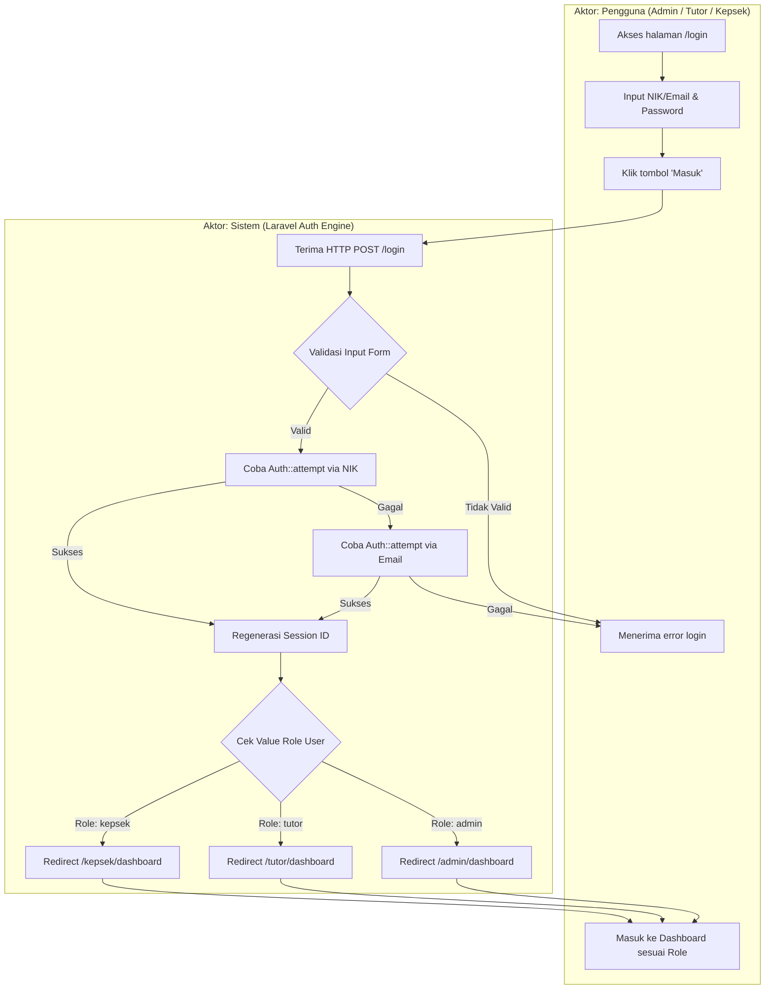

# ANALISIS MENDALAM ALUR SISTEM DAN PROSES BISNIS
## Aplikasi Presensi Digital PKBM Pikat berbasis Laravel 12

---

## 1. PENDAHULUAN & GAMBARAN UMUM ARSITEKTUR

Aplikasi **Presensi App PKBM Pikat** adalah sistem informasi manajemen kehadiran digital berbasis web yang dikembangkan menggunakan framework **Laravel 12**, **PHP 8.2+**, dan basis data **MySQL**. Sistem ini dirancang untuk memfasilitasi pencatatan kehadiran tutor saat mengajar siswa, pengelolaan data master, pengajuan presensi susulan (lupa lapor), pencatatan izin, presensi karyawan/staf, hingga rekapitulasi dan ekspor laporan periodik.

Sistem menerapkan arsitektur **Model-View-Controller (MVC)** dengan pengamanan akses berbasis peran (**Role-Based Access Control / RBAC**) yang membagi pengguna ke dalam 3 aktor utama:
1. **Admin** (Administrator Sistem)
2. **Tutor** (Tenaga Pendidik / Pengajar)
3. **Kepala Sekolah** (Manajemen & Verifikator)

Selain 3 aktor manusia di atas, terdapat 1 aktor teknis:
4. **Sistem (Laravel Backend & Database)** yang mengeksekusi validasi, logika bisnis, penyimpanan berkas, dan kalkulasi waktu berbasis WIB (`Asia/Jakarta`).

---

## 2. MATRIKS AKTOR DAN HAK AKSES SISTEM

| Modul / Fitur | Admin | Tutor | Kepala Sekolah | Sistem (Backend) |
|---|:---:|:---:|:---:|:---:|
| **Autentikasi (NIK / Email)** | ✅ | ✅ | ✅ | Validasi, Hashing & Session Guard |
| **Presensi Foto & GPS (Clock-In/Out)** | ❌ | ✅ | ❌ | Time-stamping WIB, Photo Upload & Rule 1-Jam |
| **Presensi Karyawan (Diri Sendiri)** | ✅ | ❌ | ✅ | Time-stamping & Photo Upload |
| **Pengajuan Lupa Lapor (Retroaktif)** | ❌ | ✅ | ❌ | Validasi Tanggal & Alasan |
| **Persetujuan & Kelola Lupa Lapor** | ❌ | ❌ | ✅ | Update Status & Notifikasi Log |
| **Kelola Data Master (Siswa, Kelas, Karyawan, Jadwal)** | ✅ | ❌ | ❌ | Transaksi DB & Relasi Data |
| **Input & Management Izin Tutor** | ✅ | ❌ | ❌ | Insert Record Presensi Status 'Izin' |
| **Monitoring Dashboard Real-Time** | ✅ | ❌ | ✅ | Agregasi Statistik Harian & Mingguan |
| **Ekspor Laporan (Excel / PDF)** | ✅ | ❌ | ✅ | Rendering DomPDF & Maatwebsite Excel |

---

## 3. ANALISIS DETAIL PROSES BISNIS & DIAGRAM SWIMLANE

### 3.1 PROSES BISNIS 1: Autentikasi & Otorisasi Pengguna (Dual-Login NIK/Email)

#### Deskripsi Proses
1. Pengguna membuka halaman login (`GET /login`).
2. Pengguna memasukkan identitas berupa NIK atau Email beserta Password.
3. **Sistem Backend** pertama kali mencoba otentikasi menggunakan NIK. Jika tidak cocok, sistem secara otomatis mencoba otentikasi menggunakan Email.
4. Jika berhasil, sistem melakukan regenerasi Session ID (mencegah *Session Fixation Attack*), lalu memeriksa variabel `role` pada pengguna (`admin`, `tutor`, atau `kepala_sekolah`).
5. **Sistem Backend** mengarahkan (*redirect*) pengguna ke dashboard yang sesuai dengan hak aksesnya. Jika gagal, sistem menampilkan pesan kesalahan (*Invalid credentials*).

#### Diagram Swimlane (Mermaid)



---

### 3.2 PROSES BISNIS 2: Presensi Harian Tutor (Clock-In & Clock-Out Foto + GPS)

#### Deskripsi Proses
1. **Tutor** masuk ke `/tutor/dashboard` untuk melihat status presensi hari ini.
2. Jika status **Belum Mulai**, Tutor memilih nama siswa yang diajar (dari daftar siswa bimbingannya).
3. Tutor mengambil foto selfie/bukti mengajar menggunakan kamera perangkat dan mengaktifkan akses lokasi GPS.
4. Tutor mengirimkan form presensi masuk (**Clock-In**).
5. **Sistem Backend** memverifikasi kepemilikan `siswa_id`, menyimpan file foto ke `public/uploads/presensi/{tutor_id}/{tgl}/`, dan mencatat `jam_mulai` berbasis waktu server WIB (`Asia/Jakarta`). Status presensi berubah menjadi **Proses**.
6. Dashboard Tutor menampilkan **Countdown Timer** sisa waktu menuju batas minimal 1 jam.
7. Setelah durasi mengajar mencapai $\ge 1$ jam, tombol **Absen Pulang (Clock-Out)** aktif.
8. Tutor mengambil foto pulang dan mengirimkan form Clock-Out.
9. **Sistem Backend** memvalidasi selisih waktu ($\ge 60$ menit), menyimpan foto pulang, dan memperbarui `jam_selesai`. Status presensi berubah menjadi **Selesai**.

#### Diagram Swimlane (Mermaid)

```mermaid
graph TB
    subgraph Tutor [" Aktor: Tutor (Pengajar) "]
        T1[Buka Dashboard Tutor] --> T2{Cek Status Presensi}
        T2 -- Belum Mulai --> T3[Pilih Siswa & Ambil Foto Masuk + GPS]
        T3 --> T4[Kirim Absen Masuk (Clock In)]
        T2 -- Dalam Proses --> T6[Tunggu Timer Minimal 1 Jam]
        T6 --> T7[Ambil Foto Pulang + GPS]
        T7 --> T8[Kirim Absen Pulang (Clock Out)]
        T2 -- Selesai --> T10[Lihat Ringkasan Presensi Hari Ini]
    end

    subgraph Sistem [" Aktor: Sistem (Backend Laravel) "]
        T4 --> S1[Terima Request Clock-In]
        S1 --> S2{Validasi Siswa Bimbingan & Foto}
        S2 -- Gagal --> E1[Kembalikan Pesan Error Validasi]
        S2 -- Lolos --> S3[Simpan Foto Masuk ke Storage]
        S3 --> S4[Insert Row DB: jam_mulai=WIB, status=pending]
        S4 --> S5[Update Status Dashboard: Dalam Proses]
        S5 --> T6

        T8 --> S6[Terima Request Clock-Out]
        S6 --> S7{Validasi Durasi >= 1 Jam}
        S7 -- Kurang dari 1 Jam --> E2[Tolak Absen Pulang & Tampilkan Timer]
        S7 -- Lolos --> S8[Simpan Foto Pulang ke Storage]
        S8 --> S9[Update DB: jam_selesai=WIB, status=hadir]
        S9 --> S10[Update Status Dashboard: Selesai]
        S10 --> T10
    end
```

---

### 3.3 PROSES BISNIS 3: Pengajuan dan Verifikasi Persetujuan Lupa Lapor (Retroaktif)

#### Deskripsi Proses
1. **Tutor** yang lupa/terkendala presensi pada tanggal yang sudah lewat membuka menu `/tutor/lupa-lapor`.
2. Tutor mengisi form: memilih siswa, tanggal mengajar (maksimal hari ini), jam mulai, jam selesai, dan alasan pendukung (minimal 10 karakter).
3. **Sistem Backend** memverifikasi parameter input dan menyimpan pengajuan ke tabel `lapor__lapors` dengan `status = pending`.
4. **Kepala Sekolah** membuka menu `/kepsek/lupa-lapor` untuk meninjau seluruh pengajuan masuk.
5. Kepala Sekolah memilih tindakan: **Disetujui** atau **Ditolak** serta memberikan catatan persetujuan.
6. **Sistem Backend** mengupdate record di `lapor__lapors` (`status = disetujui/ditolak`, `catatan_kepsek`). Jika disetujui, sistem secara otomatis meng-generate atau memperbarui record presensi resmi di tabel `presensis` sehingga terhitung dalam rekapitulasi kehadiran.

#### Diagram Swimlane (Mermaid)

```mermaid
graph TB
    subgraph Tutor [" Aktor: Tutor "]
        L1[Akses Menu Lupa Lapor] --> L2[Isi Form: Siswa, Tanggal, Jam, Alasan]
        L2 --> L3[Kirim Pengajuan Lupa Lapor]
        L6[Lihat Status Pengajuan: Pending / Disetujui / Ditolak]
    end

    subgraph Kepsek [" Aktor: Kepala Sekolah "]
        K1[Akses Panel /kepsek/lupa-lapor] --> K2[Tinjau Daftar Pengajuan & Alasan]
        K2 --> K3{Keputusan Verifikasi}
        K3 -- Setujui --> K4[Pilih Status: Disetujui + Catatan]
        K3 -- Tolak --> K5[Pilih Status: Ditolak + Catatan]
        K4 --> K6[Kirim Hasil Verifikasi]
        K5 --> K6
    end

    subgraph Sistem [" Aktor: Sistem (Backend) "]
        L3 --> S1[Validasi Input Tanggal <= Today & Alasan >= 10 Karakter]
        S1 -- Valid --> S2[Insert ke Table lapor__lapors (status=pending)]
        S2 --> L6
        S2 --> K1

        K6 --> S3[Update status & catatan_kepsek di lapor__lapors]
        S3 --> S4{Apakah Disetujui?}
        S4 -- Ya --> S5[Upsert Data Kehadiran di Tabel presensis]
        S4 -- Tidak --> S6[Simpan Penolakan]
        S5 --> S7[Update Rekap Kehadiran Real-time]
        S6 --> S7
        S7 --> L6
    end
```

---

### 3.4 PROSES BISNIS 4: Manajemen Data Master & Input Izin Tutor oleh Admin

#### Deskripsi Proses
1. **Admin** mengakses portal `/admin/dashboard` untuk mengelola data pendukung.
2. **Pengelolaan Data Master:** Admin melakukan CRUD pada Data Siswa (penugasan tutor & kelas), Data Kelas, Data Agenda/Jadwal, dan Data Karyawan/User (Role & Status Aktif).
3. **Penginputan Izin Tutor:**
   - Admin membuka `/admin/izin`.
   - Admin memilih nama Tutor, kemudian sistem secara dinamis via AJAX memuat daftar Siswa bimbingan tutor tersebut.
   - Admin menentukan tanggal izin dan keterangan.
4. **Sistem Backend** melakukan verifikasi dan memasukkan record presensi dengan `status = izin` ke tabel `presensis`.

#### Diagram Swimlane (Mermaid)

```mermaid
graph TB
    subgraph Admin [" Aktor: Admin "]
        M1[Buka Panel Admin] --> M2{Pilih Operasi Modul}
        M2 -- Kelola Siswa / Kelas / User --> M3[Input / Edit Data Master]
        M3 --> M4[Kirim Form CRUD]
        M2 -- Input Izin Tutor --> M5[Pilih Tutor & Load Siswa via AJAX]
        M5 --> M6[Input Tanggal Izin & Keterangan]
        M6 --> M7[Kirim Form Izin]
    end

    subgraph Backend [" Aktor: Sistem (Backend & Database) "]
        M4 --> B1[Validasi Input Data Master]
        B1 -- Lolos --> B2[Eksekusi SQL Insert/Update/Delete]
        B2 --> B3[Tampilkan Flash Message Sukses]

        M7 --> B4[Validasi Data Izin]
        B4 -- Lolos --> B5[Insert Row ke Tabel presensis (status=izin)]
        B5 --> B6[Update Status Kehadiran Tutor]
        B6 --> B3
    end
```

---

### 3.5 PROSES BISNIS 5: Monitoring, Evaluasi, dan Ekspor Laporan Presensi

#### Deskripsi Proses
1. **Admin** dan **Kepala Sekolah** dapat melakukan peninjauan rekapitulasi kehadiran secara berkala.
2. **Admin** (`/admin/laporan`) menyaring data presensi berdasarkan rentang tanggal, nama tutor, nama siswa, dan status kehadiran (`hadir`, `izin`, `alpha`).
3. **Kepala Sekolah** (`/kepsek/laporan`) meninjau rekap kinerja per tutor, persentase kehadiran, total jam mengajar, dan status verifikasi lupa lapor.
4. Pihak manajemen menentukan format ekspor: **Excel (XLSX)** atau **PDF (A4 Landscape/Portrait)**.
5. **Sistem Backend** memproses query agregasi data, mengompilasi template Blade ke dalam spreadsheet Excel (via `Maatwebsite\Excel`) atau file PDF (via `DomPDF`), dan mengunduh berkas (*download stream*) ke perangkat pengguna.

#### Diagram Swimlane (Mermaid)

```mermaid
graph TB
    subgraph Manajemen [" Aktor: Admin / Kepala Sekolah "]
        R1[Akses Menu Laporan Presensi] --> R2[Pilih Filter: Periode, Tutor, Siswa, Status]
        R2 --> R3[Tampilkan Preview Tabel & Grafik]
        R3 --> R4{Pilih Opsi Ekspor}
        R4 -- Ekspor Excel --> R5[Klik Tombol 'Export XLSX']
        R4 -- Ekspor PDF --> R6[Klik Tombol 'Export PDF']
        R7[Terima & Unduh File Laporan]
    end

    subgraph Backend [" Aktor: Sistem (Backend Engine) "]
        R2 --> S1[Query Database presensis dengan Filter]
        S1 --> S2[Kalkulasi Total Jam & Persentase Hadir]
        S2 --> R3

        R5 --> S3[Panggil PresensiExport (Maatwebsite Excel)]
        S3 --> S4[Build Spreadsheet Format .xlsx]
        S4 --> R7

        R6 --> S5[Render Template Blade ke HTML]
        S5 --> S6[Konversi HTML ke PDF via DomPDF Engine]
        S6 --> R7
    end
```

---

### 3.6 PROSES BISNIS 6: Presensi Mandiri Karyawan (Admin & Kepala Sekolah)

#### Deskripsi Proses
1. **Admin** atau **Kepala Sekolah** mengakses modul `/admin/presensi` atau `/kepsek/presensi`.
2. Pengguna mengambil foto masuk (Clock-In) dan mengaktifkan GPS.
3. **Sistem Backend** mencatat waktu masuk pengguna di tabel `presensi_karyawans`.
4. Setelah menyelesaikan tugas harian ($\ge 1$ jam), pengguna mengambil foto pulang (Clock-Out).
5. **Sistem Backend** memvalidasi dan mencatat jam selesai di tabel `presensi_karyawans`.

#### Diagram Swimlane (Mermaid)

```mermaid
graph TB
    subgraph Karyawan [" Aktor: Admin / Kepsek (Sebagai Karyawan) "]
        K1[Akses Menu Presensi Karyawan] --> K2[Ambil Foto Masuk & Klik Clock-In]
        K3[Bekerja / Menjalankan Tugas] --> K4[Ambil Foto Pulang & Klik Clock-Out]
        K5[Lihat Status Presensi Karyawan Selesai]
    end

    subgraph Backend [" Aktor: Sistem (Backend) "]
        K2 --> B1[Validasi Foto & Lokasi GPS]
        B1 --> B2[Insert Record ke presensi_karyawans (jam_mulai=WIB)]
        B2 --> K3

        K4 --> B3[Validasi Durasi Kerja >= 1 Jam]
        B3 --> B4[Update Record presensi_karyawans (jam_selesai=WIB)]
        B4 --> K5
    end
```

---

## 4. KESIMPULAN & REKOMENDASI PENGEMBANGAN ALUR

Berdasarkan analisis alur proses bisnis dan arsitektur sistem di atas, alur kerja utama aplikasi Presensi PKBM Pikat telah terstruktur dengan jelas dengan pemisahan peran yang tegas.

### Rekomendasi Alur Lupa Lapor & Validasi Data:
1. **Persetujuan Lupa Lapor Digital:** Integrasi alur persetujuan Kepala Sekolah secara utuh (penambahan status `disetujui`/`ditolak` di DB dan pembaruan otomatis ke tabel `presensis`).
2. **Validasi Strict Kepemilikan Siswa:** Memastikan server selalu memvalidasi relasi `tutor_id` dan `siswa_id` pada Endpoint Presensi Foto untuk mencegah *parameter tampering*.
3. **Keamanan Login:** Penerapan *Rate Limiting* (misal 5 percobaan/menit) pada `POST /login` guna melindungi alur autentikasi dari serangan *brute force*.
