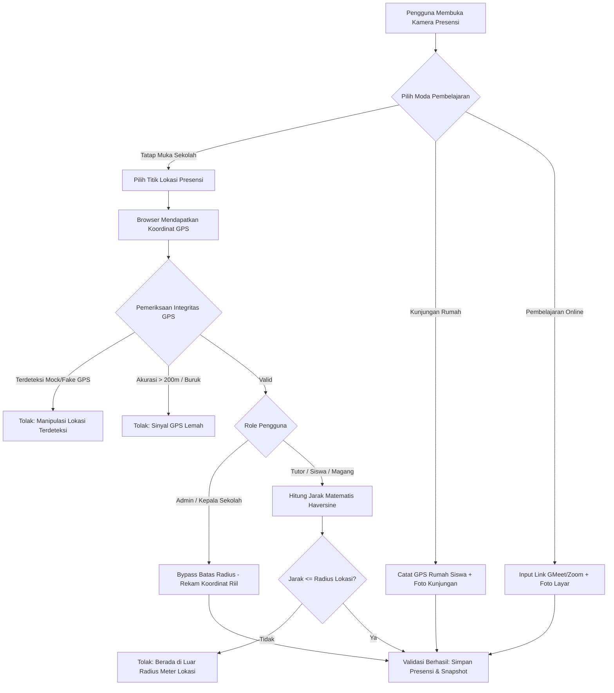

# LAPORAN ANALISIS PEMBARUAN DAN PENGEMBANGAN SISTEM
## SISTEM PRESENSI DIGITAL PUSAT KEGIATAN BELAJAR MASYARAKAT (PKBM) PIKAT
### Berbasis Framework Laravel 13 & Arsitektur Multi-Role Responsif

---

**Dokumen Rujukan:** `docs/roadmap_pengembangan_sistem_presensi.md` & `docs/progress_pengembangan_sistem_presensi.md`  
**Versi Basis Sistem:** Laravel v13.31.0 | PHP v8.5.1 | MariaDB / MySQL  
**Penyusun:** Tim Pengembang / Mahasiswa Praktik Kerja Lapangan (PKL)  
**Institusi Mitra:** PKBM Pikat  
**Peruntukan:** Bahan Penyusunan Laporan Analisis Pengembangan Sistem, Bab Pembahasan / Hasil Pengembangan PKL, dan Dokumentasi Teknis Audit Perangkat Lunak  

---

## DAFTAR ISI

1. [BAB I: PENDAHULUAN DAN GAMBARAN UMUM TRANSFORMASI SISTEM](#bab-i-pendahuluan-dan-gambaran-umum-transformasi-sistem)
   - 1.1 Latar Belakang Transformasi Sistem
   - 1.2 Tujuan Dokumen Analisis Pembaruan
   - 1.3 Metodologi Rekayasa dan Pendekatan Pembaruan
2. [BAB II: MATRIKS REKAPITULASI PEMBARUAN SISTEM](#bab-ii-matriks-rekapitulasi-pembaruan-sistem)
3. [BAB III: PEMBAHASAN DETAIL PEMBARUAN, LATAR BELAKANG, DAN ALASAN KEPUTUSAN TEKNIS](#bab-iii-pembahasan-detail-pembaruan-latar-belakang-dan-alasan-keputusan-teknis)
   - 3.1 Penguatan Keamanan, Fondasi Infrastruktur, dan Kompatibilitas Framework
   - 3.2 Peningkatan Fitur Inti Presensi, Multi-Moda, dan Validasi Lokasi Berbasis Radius
   - 3.3 Modernisasi Infrastruktur Peta Leaflet dan Eliminasi Dependensi Eksternal
   - 3.4 Reformasi Sistem Penggajian dan Honorarium Tutor Berbasis SK Kepala PKBM
   - 3.5 Penjadwalan Sesi Belajar KBM, Pola Rutin, Desentralisasi Tutor, dan Reschedule Terstruktur
   - 3.6 Arsitektur Presensi Mandiri Siswa, Smart Time-Gating, dan Evaluasi Keterlambatan
   - 3.7 Harmonisasi Logika Sesi Durasi Non-SK Lintas 4 Peran Pengguna
   - 3.8 Master Data Relasional Akademik, Siklus Hidup Siswa, dan Deteksi Multi-Rombel
   - 3.9 Sistem Notifikasi Web Push Real-Time dan Integrasi Pertukaran Data Massal
   - 3.10 Standardisasi UI/UX, Design System Terpusat, dan Responsivitas Mobile
   - 3.11 Jaminan Mutu Perangkat Lunak (QA), Developer Experience, dan Standardisasi Codebase
4. [BAB IV: IMPLIKASI DAN DAMPAK OPERASIONAL PENGEMBANGAN SISTEM](#bab-iv-implikasi-dan-dampak-operasional-pengembangan-sistem)
   - 4.1 Efisiensi Administrasi dan Integritas Finansial
   - 4.2 Pengalaman Pengguna dan Ergonomi Akses Mobile
   - 4.3 Ketahanan Infrastruktur dan Skalabilitas
5. [BAB V: KESIMPULAN DAN REKOMENDASI TAHAP LANJUTAN](#bab-v-kesimpulan-dan-rekomendasi-tahap-lanjutan)

---

# BAB I: PENDAHULUAN DAN GAMBARAN UMUM TRANSFORMASI SISTEM

### 1.1 Latar Belakang Transformasi Sistem

Sistem Presensi Digital PKBM Pikat pada mulanya dikembangkan untuk memenuhi kebutuhan pencatatan kehadiran tutor bimbingan belajar secara digital melalui foto kamera dan pencatatan koordinat GPS. Namun, seiring dengan dinamika operasional bimbingan belajar non-formal yang semakin kompleks, sistem terdahulu (*legacy system*) menghadapi berbagai kendala teknis, inkonsistensi arsitektur data, celah keamanan, dan keterbatasan fungsional. 

Pada sistem terdahulu, logika penggajian tutor masih didasarkan pada perkalian tarif per jam yang tersimpan statis pada tabel siswa. Pola ini tidak mencerminkan realitas hukum dan manajemen sekolah yang berpedoman pada Surat Keputusan (SK) Kepala PKBM mengenai tarif honor per pertemuan berdasarkan kategori tutorial (Komunitas, Distance Learning, ABK, dan Gabungan Rombel). Selain itu, sistem lama belum memiliki mekanisme penjadwalan sesi belajar mandiri oleh tutor, belum mengakomodasi peran siswa untuk melakukan presensi mandiri, belum mampu mendeteksi manipulasi sinyal GPS (*mock location*), rentan terhadap kegagalan infrastruktur akibat dependensi CDN pihak ketiga, dan kerap mengalami pesan peringatan usang (*deprecation warning*) pada lingkungan runtime PHP 8.5+.

Menanggapi berbagai tantangan tersebut, dilakukan restrukturisasi menyeluruh dan pengembangan bertahap (*multi-phase refactoring*) yang mencakup perbaikan keamanan, penguatan integritas basis data relasional, otomasi payroll berskema SK, desentralisasi penjadwalan KBM, implementasi portal presensi siswa, penyediaan Web Push Notification real-time, hingga modernisasi antarmuka pengguna berbasis *Mobile-First Design System*.

### 1.2 Tujuan Dokumen Analisis Pembaruan

Dokumen ini disusun sebagai instrumen pelaporan komprehensif yang menguraikan secara sistematis seluruh pembaruan teknis yang telah diterapkan pada Sistem Presensi Digital PKBM Pikat. Dokumen ini bertujuan untuk:
1. Menyajikan daftar lengkap seluruh item pembaruan sistem yang telah diselesaikan berdasarkan pelacak dokumen *Roadmap* dan *Progress Pengembangan*.
2. Memberikan penjelasan mendalam dalam bentuk paragraf deskriptif mengenai latar belakang permasalahan pada sistem terdahulu, solusi teknis yang diimplementasikan, serta argumentasi atau alasan logis yang mendasari setiap keputusan arsitektur.
3. Menjadi acuan formal bagi penyusunan Laporan Praktik Kerja Lapangan (PKL), Laporan Analisis Sistem, maupun dokumentasi serah-terima teknis (*technical handover*) bagi pemangku kepentingan PKBM Pikat.

### 1.3 Metodologi Rekayasa dan Pendekatan Pembaruan

Pengembangan dan refaktorisasi sistem dilaksanakan dengan mengacu pada prinsip rekayasa perangkat lunak modern:
- **Clean Architecture & Domain Separation:** Memisahkan logika bisnis kompleks ke dalam *Dedicated Service Layer* (misalnya `PayrollService`, `GeofencingService`, `JadwalRutinService`, `ShiftPresensiService`, dan `WebPushService`) untuk mencegah terjadinya *Fat Controller*.
- **Database Normalization & Data Integrity Protection:** Menghilangkan redundansi data, menerapkan *Foreign Key Constraints* dengan strategi penghapusan bertingkat (*ON DELETE SET NULL* / *SoftDeletes*), serta memastikan sifat *immutable* (kekal) pada data transaksi finansial masa lalu.
- **Defensive Programming & Resilience:** Menjamin sistem mandiri tanpa ketergantungan CDN eksternal yang rentan terhadap pemblokiran atau perubahan skema lisensi, serta memvalidasi integritas sinyal GPS pengguna secara berlapis.
- **Automated Verification:** Setiap modul baru dan perbaikan bug wajib diverifikasi melalui rangkaian pengujian otomatis (*Automated Feature & Unit Testing*) menggunakan framework PHPUnit, dengan tingkat keberhasilan 100% sebelum dirilis ke lingkungan produksi.

---

# BAB II: MATRIKS REKAPITULASI PEMBARUAN SISTEM

Tabel berikut merangkum seluruh pembaruan substansial yang telah diimplementasikan, mencakup modul terdampak, esensi perubahan, dan status implementasinya:

| No | Modul / Kategori | Komponen Teknis Terdampak | Ringkasan Pembaruan yang Dilakukan | Status |
|---|---|---|---|---|
| 1 | **Keamanan & Infrastruktur** | `composer.json`, `config/database.php`, `bootstrap/app.php` | Upgrade framework Laravel 13, resolusi deprecation warning PHP 8.5, Rate Limiting login 5 req/menit, dan pengamanan reverse proxy SSL. | 🟢 Selesai |
| 2 | **Manajemen File & Storage** | `app/Http/Controllers/*`, `app/Models/*`, `public/uploads` | Migrasi total berkas dari `public/uploads/` ke `storage/app/public/`, eliminasi prefix redundan, pembersihan symlink, dan penerapan Eloquent Accessor URL. | 🟢 Selesai |
| 3 | **Workflow Lupa Lapor** | `PengajuanLupaLapor.php`, `Kepsek\PresensiController` | Standardisasi penamaan tabel, persetujuan interaktif Kepala Sekolah (Setujui/Tolak), dan otomasi upsert kehadiran ke tabel presensi resmi. | 🟢 Selesai |
| 4 | **Core Presensi Multi-Moda** | `Presensi.php`, `presensi_foto.blade.php` | Penambahan moda Sekolah (geofencing ketat), Kunjungan Rumah (catat koordinat murid), dan Pembelajaran Daring (unggah link rapat & tangkapan layar). | 🟢 Selesai |
| 5 | **Multi-Geofence Radius** | `LokasiPresensi.php`, `Admin\LokasiPresensiController` | Master CRUD multi-titik presensi (pusat, cabang, mitra) dengan pengaturan radius toleransi dinamis per lokasi dan validasi Haversine server-side. | 🟢 Selesai |
| 6 | **Modernisasi Peta Leaflet** | `resources/js/leaflet-presensi.js`, `package.json` | Eliminasi total CDN eksternal, bundling aset lokal Leaflet via Vite, CSS dark mode filter bebas API key & tanpa watermark, dan modul bersama kamera. | 🟢 Selesai |
| 7 | **Geofencing & Anti-Fake GPS** | `GeofencingService.php`, `config/lokasi.php` | Kalkulasi jarak Haversine, live tracking polyline, proximity radar card, penolakan aplikasi mock location, dan filter batas akurasi sinyal 200m. | 🟢 Selesai |
| 8 | **Kontrol Kamera Lanjutan** | `presensi_foto.blade.php` (Multi-Role) | Kontrol kamera browser lengkap: Mirror horizontal flip, Switch kamera depan/belakang, Overlay Grid 3x3 komposisi, dan deteksi senter/flash. | 🟢 Selesai |
| 9 | **Role Karyawan Magang** | `Magang.php`, `MagangPresensiController.php` | Modul presensi mandiri khusus mahasiswa magang/PKL berbasis Clock-In/Clock-Out selfie dan geofencing 100m, dashboard, dan ekspor laporan PDF. | 🟢 Selesai |
| 10 | **Pengajuan Izin & Sakit** | `PengajuanIzinSakit.php`, `Tutor\IzinController` | Formulir mandiri pengajuan izin/sakit tutor berlampiran bukti dokumen/surat dokter, dengan alur persetujuan Kepala Sekolah dan sinkronisasi presensi. | 🟢 Selesai |
| 11 | **Payroll SK Dinamis** | `PayrollService.php`, `KategoriTutorial.php` | Master 6 tarif honor SK Kepala PKBM, engine pencocokan otomatis, snapshot immutability nominal honor masa lalu, dan drop kolom legacy `tarif_per_jam`. | 🟢 Selesai |
| 12 | **Dinamisasi Jenis Layanan** | `Admin\KategoriTutorialController`, `app.css` | Fleksibilitas penambahan jenis layanan baru tanpa batas enum, interface responsif full-page, dan proteksi hapus berelasi (alih status non-aktif). | 🟢 Selesai |
| 13 | **Penjadwalan Sesi Pengganti** | `JadwalSesi.php`, `ShiftPresensiService.php` | Relasi sesi belajar KBM, evaluasi keterlambatan presisi terhadap jam rencana sesi pengganti (bukan jam shift default), dan integrasi kamera. | 🟢 Selesai |
| 14 | **Master Jadwal Rutin & Generator** | `JadwalRutinService.php`, `Console\Kernel` | Master pola KBM berulang mingguan, generator otomatis 4 minggu ke depan via cron scheduler, dan penanganan deteksi hari libur akademik. | 🟢 Selesai |
| 15 | **Desentralisasi Jadwal Tutor** | `Tutor\JadwalSesiController`, `jadwal_sesi/index` | Otonomi tutor menyepakati jadwal dengan murid, modal terpadu 2-in-1 (rutin berulang vs sesi sekali), dan tab kelola pola mandiri tanpa beban admin. | 🟢 Selesai |
| 16 | **Reschedule Terstruktur** | `JadwalSesiController::reschedule()` | Alur penundaan sesi Opsi 2 (audit trail preserved: sesi lama dibatalkan ber-alasan, sesi pengganti baru terbentuk, terkunci rapat bila sudah hadir). | 🟢 Selesai |
| 17 | **Peleburan Kalender Agenda** | `Tutor\JadwalSesiController`, `app.css` | Peleburan halaman `/tutor/jadwal` ke dalam `/tutor/jadwal-sesi` sebagai Tab 3, redirect backward-compatible, dan grid kalender multi-dot (sesi & agenda). | 🟢 Selesai |
| 18 | **Portal Presensi Mandiri Siswa** | `SiswaPresensiController.php`, `siswas` | Single check-in harian kedatangan siswa, integrasi Leaflet geofence sekolah, eliminasi countdown pulang 15 menit, dan dashboard dua status ringkas. | 🟢 Selesai |
| 19 | **Smart Presensi Time-Gating** | `SiswaPresensiController.php`, `presensi_foto` | Penguncian kamera absensi siswa sebelum H-30 menit jam mulai KBM, live countdown timer, dan eliminasi lock-out pasca tutor clock-in. | 🟢 Selesai |
| 20 | **Penanda Keterlambatan Siswa** | `PresensiMandiriSiswa.php`, database migration | Evaluasi batas toleransi 30 menit KBM, pencatatan otomatis status keterlambatan & menit terlambat, alert visual real-time, dan chip badge UI. | 🟢 Selesai |
| 21 | **Anti Double-Counting Kehadiran** | `SiswaDashboardController.php` | Agregasi statistik kehadiran siswa berbasis tanggal unik (`DISTINCT` dates) guna mencegah penggelembungan hitungan saat murid & tutor sama-sama absen. | 🟢 Selesai |
| 22 | **Standardisasi Integer Sanitizer** | `PresensiFotoController`, script timer browser | Pembersihan tipe data microsecond float pada penghitungan Carbon diff dan modulo timer browser, menghasilkan display countdown bulat `MM:SS`. | 🟢 Selesai |
| 23 | **Harmonisasi Sesi Non-SK** | `PayrollService`, `PresensiFotoController` | Sinkronisasi 4-role untuk sesi berdurasi non-SK: warning callout tutor, clock-out adaptif 70%, toleransi proporsional siswa, tag admin, & audit payroll. | 🟢 Selesai |
| 24 | **Master Akademik & Siklus Siswa** | `jenjang_pakets`, `kelas`, `siswas` | Pemisahan entitas jenjang paket murni, foreign key relasional, siklus hidup siswa (`aktif`, `alumni`, `cuti`, `nonaktif`), dan SoftDeletes anti data-loss. | 🟢 Selesai |
| 25 | **Deteksi Otomatis Multi-Rombel** | `PayrollService::resolveHonorSesi()` | Deteksi otomatis sesi tutorial gabungan komunitas yang melibatkan siswa dari $>1$ kelas/rombel berbeda untuk penerapan tarif Rp 50.000/rombel. | 🟢 Selesai |
| 26 | **Web Push Notification Multi-Role** | `WebPushService.php`, `push_subscriptions` | Pengiriman notifikasi browser real-time berstandar VAPID ke 5 role pengguna, auto-reconnect token, trigger KBM/reschedule, dan cron reminder presensi. | 🟢 Selesai |
| 27 | **Manajemen Impor/Ekspor Excel** | `PresensiExport.php`, modal import admin | Rekapitulasi laporan presensi 14 kolom lengkap dengan metrik KPI, impor/ekspor massal data siswa, akun, dan agenda ber-template terstandarisasi. | 🟢 Selesai |
| 28 | **Executive Dashboard Analytics** | `AnalyticsService.php`, `kepsek/dashboard` | Visualisasi tren kehadiran 6 bulan terakhir berbasis Chart.js, analisis rasio ketepatan waktu, dan leaderboard kedisiplinan tutor berperingkat emas/perak. | 🟢 Selesai |
| 29 | **Redesain Halaman Login** | `resources/views/auth/login.blade.php`, `app.css` | Transformasi layout responsive split-card desktop & mobile-first compact card, show/hide password, instant dark mode switcher, dan floating toast. | 🟢 Selesai |
| 30 | **Pusat Pengelolaan Akun Terpadu** | `admin/karyawan/index.blade.php` | Sentralisasi manajemen 5 role akun (Admin, Kepsek, Tutor, Siswa, Magang), filter cerdas, kartu metrik, reset password instan, dan link lintas data. | 🟢 Selesai |
| 31 | **Sistem Pagination Dwibahasa** | `resources/views/vendor/pagination/custom` | Standarisasi pagination bahasa Indonesia terpusat via `AppServiceProvider`, responsif desktop (page pills) dan mobile (compact touch navigation). | 🟢 Selesai |
| 32 | **Quick Login & Role Switcher Dev** | `AuthWebController.php`, `navigasi_atas` | Panel login 1-klik 5 persona demo (Tasya, Dara, Tari, Alif, Zeldi), rute GET cepat `/quick-login/{role}`, topbar quick switcher ⚡, dan auto-provisioning. | 🟢 Selesai |
| 33 | **Bebas Radius Admin & Kepsek** | `GeofencingService.php`, `tests/Feature` | Pengecualian batas radius presensi bagi pimpinan dan staf manajemen saat berdinas luar/rapat koordinasi, dengan tetap merekam koordinat GPS aktual. | 🟢 Selesai |
| 34 | **Standardisasi Codebase & QA** | `tests/Feature/*`, `vendor/bin/pint` | Kode terformat 100% PSR-12/Laravel Pint, isolasi seeding khusus akun pengguna, dan seluruh 142 Feature Tests (607 assertions) lulus 100%. | 🟢 Selesai |

---

# BAB III: PEMBAHASAN DETAIL PEMBARUAN, LATAR BELAKANG, DAN ALASAN KEPUTUSAN TEKNIS

### 3.1 Penguatan Keamanan, Fondasi Infrastruktur, dan Kompatibilitas Framework

#### Latar Belakang dan Identifikasi Masalah
Pada saat audit awal sistem dilakukan, codebase masih mengandalkan versi framework Laravel lama dan berjalan di lingkungan runtime PHP 8.5 dengan sejumlah peringatan kegagalan. Di file konfigurasi `config/database.php`, koneksi database MySQL memanggil konstanta `PDO::MYSQL_ATTR_SSL_CA` yang telah dinyatakan *deprecated* pada PHP 8.5. Jika dibiarkan, konstanta ini akan memicu *Fatal Error* pada rilis minor PHP berikutnya yang berakibat pada kegagalan total inisialisasi basis data. Selain itu, ditemukan ratusan baris log error pada file `error_log` di direktori sumber yang ditinggalkan oleh Apache/cPanel, yang berisiko mengekspos kredensial dan arsitektur server bila terunggah ke repositori publik. Di sisi keamanan autentikasi, endpoint login tidak dilengkapi pembatasan frekuensi permintaan (*rate limiting*), sehingga rentan terhadap serangan brute force dan credential stuffing. Ketika sistem diakses melalui reverse proxy atau tunneling HTTPS, aset PWA dan Web Push kerap mengalami penolakan peramban akibat isu *Mixed Content*.

#### Uraian Pembaruan Sistem yang Dilakukan
1. Melakukan peningkatan (*upgrade*) dependensi framework pada `composer.json` ke **Laravel versi 13 (v13.31.0)** dan `laravel/tinker: ^3.0`, serta menyelaraskan package pendukung seperti `nunomaduro/collision`.
2. Memperbarui penanganan koneksi PDO di `config/database.php` menggunakan pengecekan dinamis:  
   `(defined('Pdo\Mysql::ATTR_SSL_CA') ? Pdo\Mysql::ATTR_SSL_CA : PDO::MYSQL_ATTR_SSL_CA)`  
   sehingga kompatibel penuh dengan PHP 8.5+ tanpa memicu peringatan deprecation.
3. Mengimplementasikan rate limiting ketat pada rute autentikasi web dan API menggunakan middleware `throttle:login` (maksimal 5 kali percobaan per menit per alamat IP/akun), lengkap dengan respons ramah pengguna (pesan peringatan interaktif dan kode HTTP 429).
4. Menambahkan konfigurasi `$middleware->trustProxies(at: '*')` pada `bootstrap/app.php` dan pemaksaan skema protokol aman `URL::forceScheme('https')` pada `AppServiceProvider` apabila peramban mendeteksi header `X-Forwarded-Proto === 'https'`.
5. Membersihkan seluruh file `error_log` liar, mengalihkan pencatatan log murni ke `storage/logs/laravel.log`, dan menambahkan pola proteksi pada `.gitignore`.

#### Alasan dan Pertimbangan Keputusan Teknis
Keputusan melakukan upgrade framework dan resolusi konstanta database diambil demi memastikan keberlanjutan siklus hidup (*lifecycle*) aplikasi jangka panjang tanpa risiko kegagalan mendadak akibat pembaruan lingkungan hosting. Penerapan rate limiting merupakan standar fundamental mitigasi keamanan OWASP untuk melindungi kerahasiaan akun tenaga pendidik dan administrator dari percobaan pembobolan kata sandi otomatis. Sementara itu, penegakan HTTPS melalui reverse proxy mutlak diperlukan karena fitur modern peramban seperti *Progressive Web App (PWA)*, *Geolocation API*, dan *Web Push Notification* mensyaratkan *Secure Context* (HTTPS) agar dapat beroperasi.

---

### 3.2 Peningkatan Fitur Inti Presensi, Multi-Moda, dan Validasi Lokasi Berbasis Radius

#### Latar Belakang dan Identifikasi Masalah
Sistem presensi terdahulu mengasumsikan seluruh kegiatan belajar-mengajar (KBM) berlangsung secara tatap muka di satu titik fisik gedung PKBM Pikat. Pada kenyataannya, PKBM Pikat menyelenggarakan beragam model pembelajaran yang mencakup kelas reguler di sekolah, kunjungan ke rumah peserta didik (*home visit / homeschooling*), serta pembelajaran jarak jauh daring (*online tutoring*). Ketiadaan pembeda moda pembelajaran menyebabkan tutor yang bertugas secara daring atau kunjungan rumah terblokir oleh validasi lokasi sekolah. Selain itu, penyimpanan berkas foto presensi sebelumnya diletakkan langsung di direktori `public/uploads/` yang terbuka bagi publik, tidak terabstraksi melalui storage driver Laravel, dan menimbulkan celah manipulasi lokasi menggunakan aplikasi pemalsu GPS (*Fake GPS / Mock Location*).

#### Uraian Pembaruan Sistem yang Dilakukan
1. **Presensi Multi-Moda:** Menambahkan kolom `moda_pembelajaran` (`sekolah`, `kunjungan_rumah`, `online`) dan `link_daring` pada tabel `presensis`.
   - *Tatap Muka Sekolah:* Menerapkan geofencing ketat terhadap radius titik resmi PKBM Pikat.
   - *Kunjungan Rumah:* Mengizinkan pencatatan di luar titik sekolah dengan merekam koordinat riil rumah siswa dan bukti foto bersama murid.
   - *Pembelajaran Online:* Meniadakan pembatasan radius geografis, mewajibkan pengisian tautan ruang pertemuan (Zoom/Google Meet), dan unggahan bukti tangkapan layar sesi KBM daring.
2. **Master Multi-Titik Lokasi Presensi Dinamis:** Merancang tabel `lokasi_presensis` dan modul CRUD Admin (`Admin\LokasiPresensiController`) untuk mengelola titik-titik operasional (kampus pusat, gedung cabang, mitra belajar). Setiap lokasi memiliki koordinat latitude/longitude dan radius toleransi tersendiri (`radius_meter`).
3. **Validasi Haversine & Anti Fake-GPS:** Mengembangkan service class `App\Services\GeofencingService` dengan algoritma **Haversine Formula** untuk menghitung jarak lengkung bumi secara matematis antara posisi pengguna dan titik lokasi terpilih. Sistem menambahkan fungsi `validateGpsIntegrity()` yang secara proaktif mendeteksi *mock location provider* dan menolak presensi jika tingkat akurasi sinyal satelit melebihi ambang batas toleransi 200 meter.
4. **Abstraksi Storage dan Eliminasi Folder Redundan:** Memindahkan seluruh berkas foto dari `public/uploads/` ke disk terkelola `storage/app/public/`, menghapus prefix folder `'uploads/'` yang redundan pada controller upload, menyambungkan ulang symlink publik, serta menerapkan Eloquent Accessor aman (`$presensi->foto_mulai_url`, `$presensi->foto_selesai_url`) untuk memastikan kompatibilitas penuh.
5. **Workflow Lupa Lapor Digital:** Mentransformasi tabel legacy `lapor__lapors` menjadi `pengajuan_lupa_lapor`. Kepala Sekolah kini diberikan antarmuka persetujuan interaktif (Setujui / Tolak). Ketika Kepala Sekolah menyetujui pengajuan, sistem secara otomatis melakukan operasi *upsert* ke tabel presensi resmi (`status = 'hadir'`).
6. **Kebijakan Pengecualian Bebas Radius bagi Admin dan Kepala Sekolah:** Memberikan fleksibilitas bagi peran `admin` dan `kepala_sekolah` agar terbebas dari pembatasan radius geofence saat harus menghadiri dinas luar atau rapat koordinasi eksternal, dengan tetap mencatat titik koordinat GPS riil di basis data dan menampilkan status edukatif pada peta.

#### Alasan dan Pertimbangan Keputusan Teknis
Dukungan multi-moda merupakan representasi akurat dari model bisnis pendidikan non-formal modern yang fleksibel. Penegakan algoritma Haversine di sisi server (backend) memastikan bahwa validasi jarak tidak dapat diretas melalui modifikasi script sisi klien (browser). Penghapusan folder `public/uploads/` dan peralihan ke storage disk Laravel adalah langkah arsitektural wajib untuk mencegah eksekusi file liar di web root publik dan mempermudah migrasi ke penyimpanan awan (*Cloud Storage / S3*) di masa mendatang. Adapun mekanisme Lupa Lapor dengan otomasi *upsert* mengatasi persoalan hilangnya hak kehadiran tutor akibat kendala teknis perangkat, sekaligus menjamin akuntabilitas karena seluruh persetujuan tercatat atas izin Kepala Sekolah.

---

### 3.3 Modernisasi Infrastruktur Peta Leaflet dan Eliminasi Dependensi Eksternal

#### Latar Belakang dan Identifikasi Masalah
Implementasi peta lokasi presensi terdahulu sangat bergantung pada tautan CDN pihak ketiga (`unpkg.com/leaflet@1.9.4`) dan penarikan berkas gambar pin eksternal dari repositori GitHub publik (`raw.githubusercontent.com`). Ketergantungan ini menimbulkan beberapa kegagalan fatal:
1. Ketika koneksi internet sekolah mengalami gangguan atau terjadi pemblokiran CDN oleh penyedia layanan internet, pustaka Leaflet gagal dimuat sehingga kamera presensi berhenti berfungsi total.
2. Terdapat bug bawaan Leaflet bundler di mana peramban mencoba mencari aset bayangan ikon di subpath halaman aktif (misalnya `/admin/lokasi-presensi/marker-shadow.png`), yang menghasilkan respon error **HTTP 500 Subpath Error**.
3. Peta mode gelap (*Dark Mode*) sebelumnya memanfaatkan tile server CartoDB Dark Matter yang menerapkan kebijakan API Key berbayar. Akibatnya, pada antarmuka peta pengguna muncul watermark teks yang mengganggu: *"API KEY REQUIRED carto.com/basemap/apikey"*.
4. Ditemukan duplikasi lebih dari 100 baris kode inisialisasi peta Leaflet yang ditulis berulang-ulang di empat tampilan terpisah (`siswa`, `tutor`, `magang`, dan `karyawan`).

#### Uraian Pembaruan Sistem yang Dilakukan
1. **Bundling Mandiri via Vite:** Menghapus seluruh link eksternal dan menginstal pustaka `leaflet` langsung ke dalam dependensi proyek melalui NPM. Gaya `leaflet/dist/leaflet.css` dan modul JavaScript diimpor langsung ke pipeline `resources/js/app.js`, serta mengekspor objek global `window.L = L`.
2. **Resolusi Path Marker dan Eliminasi HTTP 500:** Menempatkan salinan fisik aset ikon resmi pada direktori `public/images/leaflet/`. Mengkonfigurasi `L.Icon.Default.mergeOptions(...)` dengan Vite image imports serta menonaktifkan prototype `_getIconUrl`, sehingga Leaflet tidak lagi memicu permintaan berkas ke subpath URL yang keliru.
3. **Tile Dark Mode Mandiri Tanpa Watermark:** Menggantikan pemanggilan CartoDB dengan layer OpenStreetMap standar yang di-styling secara dinamis menggunakan filter CSS Dark Mode (`brightness`, `invert`, `contrast`, `hue-rotate`, `saturate`) pada selector layer `.leaflet-tile` saat atribut `[data-theme="dark"]` aktif. Pendekatan ini 100% legal, gratis, bebas watermark, dan tidak memerlukan pendaftaran API Key eksternal.
4. **Sentralisasi Modul Terpadu (`resources/js/leaflet-presensi.js`):** Mengkonsolidasikan logika peta presensi ke dalam modul bersama `window.createPresensiMap(options)`. Modul ini secara otomatis menangani render pin SVG lokal beranimasi pulse, lingkaran toleransi akurasi GPS, garis panduan rute dinamis (*polyline tracker*), radar proximity, serta penyesuaian sudut pandang kamera (*fitBounds*).

#### Alasan dan Pertimbangan Keputusan Teknis
Mengeliminasi ketergantungan CDN eksternal mengubah sistem menjadi aplikasi mandiri (*self-contained application*) yang tangguh terhadap fluktuasi jaringan publik dan siap dijalankan pada lingkungan jaringan lokal tertutup (*intranet/offline-ready*). Rekayasa filter CSS untuk tema gelap memberikan konsistensi visual modern yang serasi dengan identitas grafis aplikasi tanpa membebani anggaran operasional sekolah untuk biaya langganan tile server komersial.

---

### 3.4 Reformasi Sistem Penggajian dan Honorarium Tutor Berbasis SK Kepala PKBM

#### Latar Belakang dan Identifikasi Masalah
Kelemahan paling krusial pada sistem presensi lama terletak pada domain penggajian (*payroll*). Pada skema lama, nominal honor tutor dihitung berdasarkan perkalian sederhana antara durasi jam mengajar dengan kolom `tarif_per_jam` yang disimpan pada tabel `siswas`. Skema ini melanggar logika operasional PKBM Pikat karena beberapa alasan:
1. Besaran honorarium tutor tidak ditentukan per siswa, melainkan ditetapkan secara legal melalui **Surat Keputusan (SK) Kepala PKBM** berdasarkan kategori tutorial dan durasi sesi per pertemuan.
2. Menyimpan tarif pada tabel siswa menyebabkan inkonsistensi: jika tarif siswa diubah di kemudian hari, seluruh riwayat honorarium masa lalu ikut berubah secara retroaktif (*historical data corruption*), sehingga laporan keuangan terdahulu menjadi tidak valid.
3. Siswa berkebutuhan khusus (ABK) dan kelas gabungan rombel memiliki skema kompensasi tersendiri yang tidak dapat diakomodasi oleh perkalian jam linier.
4. Pengelolaan master kategori di panel admin sebelumnya dibatasi secara kaku (*hardcoded enum*) pada tiga jenis layanan (`komunitas`, `dl`, `lainnya`), sehingga admin tidak dapat menambahkan program baru seperti *Homeschooling*, *Vokasi Khusus*, atau *Bimbingan Intensif*.

#### Uraian Pembaruan Sistem yang Dilakukan
1. **Master Kategori SK Kepala PKBM:** Merancang tabel `kategori_tutorials` yang memuat 6 skema resmi SK Kepala PKBM:
   - *Tutorial Komunitas (2 Jam):* Rp 75.000,- / pertemuan.
   - *Tutorial Komunitas ABK (2 Jam):* Rp 100.000,- / pertemuan.
   - *Tutorial Komunitas (3 Jam):* Rp 100.000,- / pertemuan.
   - *Gabungan Komunitas:* Rp 50.000,- / rombel.
   - *Tutorial Distance Learning / DL (1,5 Jam):* Rp 100.000,- / pertemuan.
   - *Tutorial DL ABK (1,5 Jam):* Rp 125.000,- / pertemuan.
2. **Dynamic Resolver & Snapshot Immutability (`PayrollService`):**
   - Menambahkan kolom `nominal_honor_snapshot` dan `kategori_tutorial_id` pada tabel `presensis`.
   - Method `PayrollService::resolveHonorSesi()` secara otomatis mengevaluasi sesi berdasarkan moda, durasi yang dipilih tutor, status ABK siswa (`siswas.is_abk`), dan keterlibatan multi-rombel.
   - Mengunci nilai nominal ke dalam `nominal_honor_snapshot` pada detik transaksi presensi disimpan. Nilai historis ini bersifat kekal (*immutable*), sehingga pembaruan tarif master di masa depan tidak akan pernah mengubah laporan audit keuangan masa lalu.
   - Menghapus kolom legacy `siswas.tarif_per_jam` secara permanen dari skema basis data.
3. **Dinamisasi Jenis Layanan & Dual-Layer Protection:**
   - Menghapus validasi kaku enum dan menggantinya dengan string fleksibel berfitur sanitasi otomatis pada `Admin\KategoriTutorialController`. Admin bebas mendefinisikan jenis layanan baru dengan dukungan *Quick Tag Pills*.
   - Menerapkan **Perlindungan Integritas Relasi Berlapis**: Apabila suatu kategori tutorial hendak dihapus oleh Admin tetapi telah memiliki keterikatan transaksi pada tabel `presensis`, `jadwal_sesis`, atau `jadwal_rutins`, sistem secara otomatis menolak penghapusan fisik (*hard delete*) dan mengalihkannya menjadi status **Non-Aktif** (`is_aktif = false`). Kategori tersebut seketika disembunyikan dari formulir jadwal baru, namun seluruh arsip riwayat presensi dan slip gaji masa lalu tetap terlindungi 100%.
4. **Slip Gaji Digital & Rekapitulasi Anggaran:** Menyediakan antarmuka cetak slip gaji digital berbasis web dan ekspor PDF resmi (`slip_pdf.blade.php`), rekapitulasi anggaran bulanan admin, serta pengiriman notifikasi broadcast payroll melalui Web Push Notification.

#### Alasan dan Pertimbangan Keputusan Teknis
Pemisahan domain tarif ke dalam master SK memulihkan tata kelola keuangan lembaga agar selaras dengan ketetapan hukum manajemen sekolah. Penerapan prinsip *Snapshot Immutability* merupakan kaidah mutlak dalam perancangan sistem informasi akuntansi dan penggajian untuk menjamin integritas data saat dilakukan audit keuangan. Di samping itu, proteksi relasi berlapis (*soft-deactivation*) mencegah timbulnya *orphaned records* (catatan yatim) dan menjaga integritas referensial basis data tanpa membatasi fleksibilitas ekspansi program bimbingan belajar baru.

---

### 3.5 Penjadwalan Sesi Belajar KBM, Pola Rutin, Desentralisasi Tutor, dan Reschedule Terstruktur

#### Latar Belakang dan Identifikasi Masalah
Salah satu kelemahan terbesar sistem sebelum pengembangan lanjutan adalah ketergantungan mutlak pada jam kerja shift statis (misalnya jam shift pagi 07:30 WIB). Pada pendidikan non-formal, tutor seringkali harus menyelenggarakan sesi bimbingan pada sore hari, sesi privat khusus, atau sesi pengganti (*make-up class*) akibat berhalangan hadir pada hari sebelumnya. Pada sistem lama, ketika tutor mengajar di luar jam shift pagi, sistem menganggap tutor terlambat berjam-jam atau menolak presensi karena berada di luar jendela waktu shift. Selain itu, admin sekolah terbebani harus menyusun jadwal satu per satu secara manual. Ketika terjadi penjadwalan ulang (*reschedule*), admin atau tutor cenderung menimpa jadwal lama yang mengakibatkan hilangnya jejak audit (*audit trail*) riwayat pembatalan. Terdapat pula duplikasi halaman navigasi di mana rute `/tutor/jadwal` terpisah dari `/tutor/jadwal-sesi` sehingga membingungkan pengguna.

#### Uraian Pembaruan Sistem yang Dilakukan
1. **Entitas Basis Data `jadwal_sesis` & Relasi Fleksibel:** Merancang tabel `jadwal_sesis` yang menghubungkan `tutor_id`, `siswa_id`, `kategori_tutorial_id`, `tanggal_rencana`, `jam_masuk_rencana`, `jam_pulang_rencana`, `durasi_jam`, serta jenis sesi (`reguler`, `pengganti`, `tambahan`, `ujian`).
2. **Evaluasi Jam Masuk Presisi (`ShiftPresensiService`):** Memperbarui method `evaluateCheckIn()` agar menerima objek `?JadwalSesi`. Sistem mengevaluasi keterlambatan tutor secara proporsional terhadap target jam sesi yang dijadwalkan (misal pukul 14:00 WIB), bukan dipaksa menggunakan jam shift pagi default.
3. **Master Jadwal Rutin & Generator Otomatis Mingguan:**
   - Merancang tabel `jadwal_rutins` dan model `JadwalRutin` sebagai master template pola berulang mingguan.
   - Mengembangkan `JadwalRutinService` dan perintah scheduler `php artisan jadwal:generate-sesi` yang terpasang di Laravel Console Scheduler (`routes/console.php`) untuk men-generate otomatis sesi 4 minggu ke depan setiap hari Minggu malam, dengan kemampuan mendeteksi hari libur akademik dari tabel `jadwals`.
4. **Desentralisasi Penjadwalan Mandiri oleh Tutor:**
   - Mengalihkan wewenang pembuatan jadwal: Admin tidak lagi dibebani penyusunan jadwal bimbingan. Tutor dan Siswa dapat menyepakati waktu KBM secara langsung, lalu Tutor menginputkannya melalui portal Tutor.
   - Merancang **Modal Terpadu 2-in-1 (`modalJadwalBaru`)** dengan opsi pemilihan cerdas:
     - *Pola Rutin Mingguan:* Mengisi hari, jam, dan batas akhir (`berlaku_sampai`). Sesi di-generate otomatis secara berkelanjutan hingga batas waktu yang ditentukan.
     - *Sesi Tunggal / Pengganti:* Hanya membuat satu sesi pada tanggal tertentu tanpa membuat pola berulang.
5. **Mekanisme Reschedule Sesi Terstruktur (Opsi 2 - Audit Trail Preserved):**
   - Ketika sesi ditunda atau diganti, sesi lama **tidak dihapus**, melainkan dialihkan statusnya menjadi `'dibatalkan'` disertai rekaman alasan pembatalan (`alasan_penggantian`).
   - Sesi baru di-generate sebagai sesi bertipe `'pengganti'` yang mereferensikan kolom `tanggal_asli` ke jadwal sebelumnya.
   - *Proteksi Audit:* Sesi yang telah selesai atau telah memiliki keterikatan presensi (`presensi_id`) dikunci rapat dan tidak dapat diubah kembali.
6. **Peleburan Kalender dan Penyelarasan Antarmuka 3 Tab:**
   - Menyatukan halaman `/tutor/jadwal` ke dalam `/tutor/jadwal-sesi` sebagai **Tab 3 ("Agenda & Pengumuman PKBM")**. Rute lama dialihkan secara transparan melalui *RedirectResponse* HTTP permanen.
   - Menyediakan 3 tab navigasi terpadu: Tab 1 (Kalender Sesi Belajar Murid), Tab 2 (Master Pola Rutin Saya), dan Tab 3 (Agenda & Libur Sekolah Resmi PKBM).
   - Menghadirkan kalender visual dengan penanda multi-dot (titik biru untuk sesi KBM murid dan titik amber untuk kegiatan resmi sekolah).

#### Alasan dan Pertimbangan Keputusan Teknis
Desentralisasi penjadwalan memangkas birokrasi administratif sekolah secara drastis dan memberikan otonomi penuh kepada tutor dan murid untuk menyesuaikan ritme belajar yang fleksibel. Penerapan mekanisme Reschedule Opsi 2 menjamin prinsip akuntabilitas dan transparansi (Good Governance), karena pihak manajemen sekolah dan Kepala Sekolah dapat melacak riwayat alasan pembatalan sesi tanpa khawatir terjadi manipulasi data kehadiran atau pembayaran ganda (*double billing*).

---

### 3.6 Arsitektur Presensi Mandiri Siswa, Smart Time-Gating, dan Evaluasi Keterlambatan

#### Latar Belakang dan Identifikasi Masalah
Sebelum pengembangan Fase 4, peserta didik sama sekali tidak memiliki akses login mandiri ke dalam sistem. Kehadiran siswa hanya dicatat sepihak oleh tutor saat mengisi form presensi kelas. Hal ini menimbulkan kelemahan ganda: siswa tidak memiliki rekaman kehadiran mandiri yang dapat diverifikasi oleh orang tua, dan sekolah tidak memiliki bukti fisik kehadiran peserta didik di area gedung belajar. Ketika portal siswa dibangun, muncul kendala baru:
1. Alur awal siswa menuntut check-in dan check-out dengan jeda waktu minimal 15 menit, yang terbukti tidak praktis dan membingungkan peserta didik.
2. Siswa dapat mengakses kamera dan melakukan presensi kapan saja meskipun bukan hari belajarnya.
3. Terjadi *lock-out bug* di mana ketika tutor melakukan presensi masuk, status sesi diubah menjadi `'selesai'`, sehingga sistem siswa menganggap sesi sudah berakhir dan memblokir siswa yang hendak melakukan absensi mandiri.
4. Ketika murid melakukan absen mandiri dan tutor mencatat sesi kelas di hari yang sama, dashboard menghitung total hadir secara aritmatika sederhana ($1 + 1 = 2$), sehingga terjadi penggelembungan statistik kehadiran (*double counting*).
5. Belum ada pencatatan status keterlambatan siswa terhadap jadwal rencana KBM.

#### Uraian Pembaruan Sistem yang Dilakukan
1. **Penyederhanaan Single Check-In Mandiri:** Mengubah alur presensi mandiri siswa menjadi satu kali pencatatan kedatangan harian (*Single Check-In*) berbasis swafoto kamera dan verifikasi geofencing radius sekolah, tanpa kewajiban absen pulang atau jeda waktu hitung mundur.
2. **Smart Presensi Time-Gating:**
   - Mengembangkan proteksi pada `SiswaPresensiController` di mana antarmuka kamera absensi terkunci apabila hari tersebut bukan jadwal KBM siswa atau waktu presensi dilakukan mendahului 30 menit sebelum jadwal sesi dimulai (H-30 menit).
   - Dilengkapi *Live Countdown Timer* JavaScript dan banner edukatif yang menginformasikan sisa waktu hingga jendela absensi dibuka.
3. **Resolusi Siklus Status Sesi KBM (Eliminasi Lock-Out):**
   - Memperbaiki transisi status sesi pada `Tutor\PresensiFotoController`: saat tutor absen masuk, status sesi bertransisi menjadi `'berlangsung'`, dan baru bertransisi menjadi `'selesai'` saat tutor absen pulang.
   - Memperbarui query presensi siswa agar memvalidasi sesi dengan status bukan dibatalkan (`where('status', '!=', 'dibatalkan')`), sehingga siswa tetap dapat melakukan presensi mandiri meskipun tutor telah lebih dahulu melakukan clock-in.
4. **Pencatatan Status Keterlambatan Siswa:**
   - Melakukan migrasi penambahan kolom `status_kehadiran` (`tepat_waktu`, `terlambat`, `lebih_awal`) dan integer `menit_keterlambatan` pada tabel `presensi_mandiri_siswas`.
   - Mengkalkulasi selisih jam kedatangan terhadap batas toleransi 30 menit sesi KBM, menyematkan chip badge status real-time pada halaman kamera, kartu dashboard, dan riwayat presensi siswa, serta mengirimkan notifikasi spesifik keterlambatan melalui Web Push.
5. **Pencegahan Double-Counting Kehadiran Berbasis Tanggal Unik:**
   - Menulis ulang kalkulasi agregasi kehadiran pada `SiswaDashboardController` menggunakan pemfilteran tanggal unik:  
     `$dates = $mandiriDates->merge($sesiDates)->unique();`
   - Jika pada hari yang sama siswa melakukan absen mandiri dan tutor mencatat kehadiran sesi kelas, sistem secara akurat menghitungnya tepat sebagai 1 Hari Hadir Aktif.
6. **Standardisasi Sanitasi Integer pada Countdown Timer:**
   - Melakukan *explicit integer casting* `(int)` pada kalkulasi selisih detik Carbon dan menerapkan `Math.floor()` pada script timer browser multi-role. Hal ini mengeliminasi kemunculan angka desimal panjang pecahan mikrodetik (misal `55:24.03877300000022`) dan menghasilkan hitungan mundur bulat yang mulus berformat `MM:SS`.

#### Alasan dan Pertimbangan Keputusan Teknis
Penerapan *Single Check-In* sangat sesuai dengan karakteristik peserta didik bimbingan belajar, di mana fokus utama manajemen adalah memverifikasi ketepatan waktu kedatangan siswa di lingkungan belajar. Fitur *Smart Time-Gating* mencegah kecurangan presensi di luar jadwal, sementara evaluasi keterlambatan memberikan data objektif bagi tutor dan orang tua mengenai kedisiplinan belajar siswa. Eliminasi *double-counting* memastikan validitas laporan akademik saat diterbitkan kepada wali murid maupun dinas pendidikan.

---

### 3.7 Harmonisasi Logika Sesi Durasi Non-SK Lintas 4 Peran Pengguna

#### Latar Belakang dan Identifikasi Masalah
SK Kepala PKBM Pikat menetapkan durasi resmi tutorial bimbingan belajar adalah 1.5 jam, 2 jam, dan 3 jam dengan besaran honor flat per pertemuan. Namun dalam praktiknya di lapangan, tutor kerap membuat jadwal dengan durasi khusus di luar SK (misalnya sesi kilat 30 menit, 1 jam, atau pendalaman materi 4 jam). Kondisi ini sebelumnya menimbulkan cacat logika sistem pada 4 peran pengguna:
1. *Bagi Tutor:* Aturan default sistem mensyaratkan jarak minimal 1 jam (3600 detik) antara absen masuk dan pulang. Akibatnya, tutor yang menyelenggarakan sesi kilat (misal 30 menit atau 45 menit) terkunci (*locked-out*) dan tidak dapat melakukan absen pulang.
2. *Bagi Siswa:* Batas toleransi keterlambatan siswa dipatok kaku 30 menit. Pada sesi singkat 30 menit, siswa yang baru hadir di menit ke-25 secara keliru tetap dicatat sebagai *"Tepat Waktu"*.
3. *Bagi Admin:* Admin tidak memiliki visibilitas apakah suatu sesi berpedoman pada kurikulum resmi SK atau merupakan sesi inisiatif khusus tutor.
4. *Bagi Kepala Sekolah:* Sistem payroll mengalami kebingungan (*unresolved rate*) saat menghitung honor sesi dengan durasi di luar master SK, sehingga berisiko menimbulkan komplain keuangan saat audit.

#### Uraian Pembaruan Sistem yang Dilakukan
Mengimplementasikan solusi harmonisasi menyeluruh yang menyelaraskan hak dan batasan 4 peran pengguna (*4-Role Harmonization*):
1. **Peran Tutor (Fleksibilitas Terbimbing & Clock-Out Adaptif):**
   - Formulir pembuatan jadwal tutor dilengkapi pemilihan kategori SK otomatis. Jika tutor memasukkan durasi di luar SK, antarmuka memunculkan *Live Warning Callout* interaktif yang mengedukasi bahwa sesi ditandai sebagai non-SK dan kompensasi menggunakan tarif flat default SK.
   - Memperbarui batas minimal absen pulang tutor pada `PresensiFotoController` menggunakan ambang batas adaptif:  
     `$minWaitSec = min(3600, max(900, (int) round($durasiRencanaDetik * 0.7)));`  
     Pada sesi singkat $\le 60$ menit, tutor diizinkan absen pulang setelah memenuhi minimal 70% durasi belajar (minimal 15 menit), sehingga sesi 30 menit dapat clock-out di menit ke-21 tanpa terblokir.
2. **Peran Siswa (Toleransi Keterlambatan Proporsional):**
   - Menyesuaikan toleransi keterlambatan presensi mandiri siswa pada `SiswaPresensiController` untuk sesi $< 90$ menit menjadi proporsional:  
     `$toleranceMin = min(defaultTolerance, max(10, (int) round($durasiMenit * 0.3)));`  
     Pada sesi 30 menit, toleransi keterlambatan disesuaikan menjadi 10 menit, menjaga integritas kedisiplinan belajar.
3. **Peran Admin (Transparansi Audit Akademik):**
   - Pada `JadwalSesiController`, sistem secara otomatis menyematkan tag penanda transparan `[Jadwal Khusus: Durasi X Jam di luar SK]` pada catatan sesi dan master pola rutin, memberikan riwayat audit yang jelas bagi admin kurikulum.
4. **Peran Kepala Sekolah (Audit Finansial & Transparansi Payroll):**
   - Pada `PayrollService`, sesi di luar SK secara otomatis diberi label `Tutorial Non-SK (Aktual X.Xj - Flat Default SK)` dengan nominal snapshot tarif dasar SK terkait.
   - Pada lembar rekapitulasi payroll admin dan slip honor (`admin/payroll/show.blade.php`), sesi non-SK disematkan badge khusus berwarna oranye `Non-SK` pada tabel desktop dan kartu mobile, memberikan transparansi penuh kepada pimpinan saat memverifikasi pengeluaran anggaran.

#### Alasan dan Pertimbangan Keputusan Teknis
Pendekatan harmonisasi ini membuktikan kedewasaan arsitektur sistem: daripada membatasi secara kaku fleksibilitas proses belajar mengajar di lapangan, sistem memilih untuk mengakomodasi kebutuhan lapangan secara cerdas (*adaptive governance*) dengan tetap menjaga integritas audit finansial dan kedisiplinan akademik.

---

### 3.8 Master Data Relasional Akademik, Siklus Hidup Siswa, dan Deteksi Multi-Rombel

#### Latar Belakang dan Identifikasi Masalah
Struktur basis data awal aplikasi masih mencampurkan konsep jenjang pendidikan dengan rombongan belajar (*kelas*), di mana tingkatan kelas disimpan sebagai kolom teks bebas tanpa keterikatan kunci relasional (*Foreign Key*). Kelemahan ini berisiko menimbulkan inkonsistensi data ketika nama jenjang diubah. Selain itu, belum ada pengelolaan status siklus hidup siswa: ketika seorang siswa lulus atau mengundurkan diri, penghapusan data berisiko menghapus seluruh riwayat presensi yang pernah dilakukannya di masa lalu (*catastrophic data loss*). Pada sesi tutorial komunitas, tutor kerap menggabungkan beberapa siswa dari rombel berbeda ke dalam satu ruang belajar, namun sistem lama tidak memiliki kecerdasan buatan untuk mendeteksi hal tersebut sehingga penghitungan honor rombel gabungan (Rp 50.000,- / rombel) harus diinput manual.

#### Uraian Pembaruan Sistem yang Dilakukan
1. **Normalisasi Relasi Jenjang & Kelas:** Merancang tabel terpisah `jenjang_pakets` (Paket A, Paket B, Paket C, Vokasi, Kursus) dan menerapkan *Foreign Key* formal `kelas.jenjang_paket_id` mengarah ke `jenjang_pakets.id` dengan klausul proteksi `ON DELETE SET NULL`. Menambahkan kolom `tingkat` (varchar 50) pada tabel `kelas` untuk modularitas penamaan tingkat rombel.
2. **Siklus Hidup Siswa & Perlindungan Anti Data-Loss:**
   - Menambahkan kolom status siklus hidup pada tabel `siswas`: `aktif`, `alumni`, `cuti`, `nonaktif`.
   - Mengaktifkan fitur **SoftDeletes** (`deleted_at`) pada model `Siswa` dan `User`. Ketika siswa lulus atau diarsipkan, data historis presensi dan pencapaian KBM tetap tersimpan utuh di basis data.
   - Mengembangkan mekanisme migrasi rombel otomatis ketika admin hendak menghapus jenjang paket yang masih memiliki siswa aktif.
3. **Deteksi Otomatis Multi-Rombel (Sesi Gabungan Komunitas):**
   - Mengembangkan algoritma pada `PayrollService` yang menganalisis daftar siswa yang terdaftar dalam satu sesi tutorial.
   - Jika sistem mendeteksi siswa yang hadir berasal dari lebih dari satu kelas/rombel yang berbeda dalam jenjang yang sama, engine payroll secara otomatis mengkategorikan sesi tersebut sebagai **Sesi Gabungan Komunitas** dan menerapkan formula tarif perkalian rombel (Rp 50.000,- / rombel) secara otomatis tanpa intervensi manual tutor.

#### Alasan dan Pertimbangan Keputusan Teknis
Normalisasi relasional menjamin integritas referensial data akademik sesuai kaidah baku perancangan basis data relasional (RDBMS). Penerapan SoftDeletes merupakan perlindungan vital untuk mencegah musnahnya arsip riwayat belajar siswa yang berpotensi dibutuhkan untuk verifikasi ijazah atau akreditasi sekolah di kemudian hari. Otomasi deteksi multi-rombel meminimalisir kesalahan manusia (*human error*) dalam pelaporan honorarium tutor.

---

### 3.9 Sistem Notifikasi Web Push Real-Time dan Integrasi Pertukaran Data Massal

#### Latar Belakang dan Identifikasi Masalah
Sebelum pembaruan sistem dilakukan, koordinasi antara pihak sekolah, tutor, dan siswa sepenuhnya bergantung pada grup obrolan instan (seperti WhatsApp) yang terpisah dari sistem aplikasi. Ketika tutor menjadwalkan kelas bimbingan atau mereschedule sesi, siswa tidak menerima pemberitahuan langsung pada perangkat ponselnya. Demikian pula saat tutor mengajukan izin sakit atau permohonan lupa lapor, Kepala Sekolah baru mengetahuinya saat memeriksa dashboard secara manual. Di samping itu, admin sekolah mengalami kendala operasional saat tahun ajaran baru tiba karena harus menginput ratusan data siswa, akun karyawan, dan jadwal kalender secara satu per satu melalui formulir web biasa.

#### Uraian Pembaruan Sistem yang Dilakukan
1. **Infrastruktur Web Push Notification (VAPID):**
   - Mengintegrasikan package `minishlink/web-push`, merancang command generate kunci `webpush:vapid`, dan membuat tabel penyimpanan langganan peramban `push_subscriptions`.
   - Membangun `App\Services\WebPushService` lengkap dengan helper pengiriman spesifik multi-peran (`sendToUser`, `sendToSiswa`, `sendToTutor`, `sendToMagang`, `sendToAdmins`, `sendToKepsek`) serta perlindungan *SSL verification bypass* khusus untuk lingkungan lokal Laragon/Windows.
   - Mengembangkan modul klien JavaScript `resources/js/push-notification.js` untuk auto-sinkronisasi token browser, penanganan izin notifikasi, dan tombol uji coba mandiri di menu Profil seluruh role.
2. **Otomatisasi Trigger Push Notifikasi Sistem:**
   - Mengirim notifikasi instan ke perangkat siswa saat tutor membuat jadwal belajar baru atau melakukan reschedule sesi KBM.
   - Mengirim notifikasi instan ke tutor saat siswa bimbingannya telah tiba dan melakukan check-in mandiri di sekolah.
   - Mengirim peringatan real-time ke ponsel Kepala Sekolah saat ada pengajuan izin/sakit atau permohonan lupa lapor yang menuntut persetujuan.
   - Menyediakan perintah scheduler `presensi:send-reminder` dengan opsi `--type` (`morning`, `clockout`, `pending-approvals`) yang berjalan otomatis melalui crontab server untuk mengingatkan absensi pagi, absen pulang, dan pengingat persetujuan tertunda bagi Kepala Sekolah.
3. **Manajemen Impor dan Ekspor Data Massal (Spreadsheet Excel):**
   - Mengembangkan modul ekspor laporan komprehensif 14 kolom data presensi lengkap dengan indikator KPI (`PresensiExport.php`) menggunakan pustaka `maatwebsite/excel`.
   - Mengembangkan modul impor massal spreadsheet Excel untuk Data Siswa, Data Karyawan/Tutor, Jadwal Kalender PKBM, dan Presensi Retroaktif.
   - Merancang antarmuka modal impor modern di 4 modul Admin: banner unduh template resmi, kartu visual deteksi file terpilih (menampilkan nama, ukuran KB/MB, status badge), tombol reset file, validasi ukuran maksimal (5MB) dan ekstensi (`.xlsx`, `.xls`, `.csv`), serta dukungan penuh mode gelap (*Dark Mode*).

#### Alasan dan Pertimbangan Keputusan Teknis
Pemanfaatan Web Push Notification berstandar W3C/VAPID menghadirkan kapabilitas notifikasi layaknya aplikasi native (*Native Mobile Experience*) tanpa mewajibkan sekolah merilis aplikasi ke Google Play Store atau Apple App Store yang membutuhkan biaya langganan developer berkala. Fitur ekspor/impor massal Excel mereduksi beban kerja administratif tata usaha hingga lebih dari 80% pada masa penerimaan peserta didik baru dan mempermudah pengarsipan data untuk kebutuhan audit akreditasi pendidikan.

---

### 3.10 Standardisasi UI/UX, Design System Terpusat, dan Responsivitas Mobile

#### Latar Belakang dan Identifikasi Masalah
Sistem warisan terdahulu dibangun dengan gaya CSS inline dan styling terfragmentasi di berbagai file Blade view. Hal ini mengakibatkan inkonsistensi visual yang mencolok: tombol aksi memiliki kontras warna yang buruk di layar luar ruangan, modal dialog konfirmasi tidak dapat di-scroll pada ponsel berlayar kecil sehingga tombol submit terpotong (*overflow issues*), tabel data desktop memaksa pengguna melakukan scroll horizontal yang melelahkan di layar smartphone, formulir login memakan ruang vertikal terlalu besar dengan ilustrasi lama, dan komponen navigasi pagination masih menggunakan teks bahasa Inggris bawaan framework.

#### Uraian Pembaruan Sistem yang Dilakukan
1. **Sentralisasi Design System (`resources/css/app.css`):**
   - Menyatukan seluruh variabel desain modern menggunakan token CSS: `--blue`, `--blue2`, `--blue-gradient`, `--font-sans` (Inter), dan `--radius-xl`.
   - Menerapkan topbar navigasi *sticky*, header bagian terstandarisasi (`.sectionTitleRow`), dan sistem dialog konfirmasi responsif (`.app-modal-card`) dengan backdrop blur dan pembatasan ketinggian adaptif (`max-height: calc(100dvh - 32px)`).
   - Menstandarisasi spektrum 10 varian warna kartu KPI (`.kpi-card`): `.emerald`, `.blue`, `.cyan`, `.indigo`, `.purple`, `.amber`, `.orange`, `.rose`, `.teal`, dan `.slate`, dengan rasio kontras tinggi sesuai standar aksesibilitas WCAG pada tema terang maupun gelap.
2. **Arsitektur Tampilan Ganda (Desktop Table vs Mobile Data Card):**
   - Mengubah penyajian data tabel di seluruh panel modul (Siswa, Karyawan, Magang, Jadwal, Lokasi, Payroll) menjadi arsitektur dwimatra: menampilkan tabel klasik yang luas pada desktop ($\gt 768$px) dan otomatis bertransformasi menjadi kartu data informatif berorientasi sentuhan (`.data-mobile-card` & `.mobile-card-list`) pada layar smartphone ($\le 768$px) dengan target sentuh jempol ergonomis ($\ge 44$px).
3. **Redesain Modern Antarmuka Login Autentikasi (`auth/login`):**
   - Merancang tampilan *Desktop Split-Card* (lebar 920px) yang memadukan panel showcase identitas brand PKBM Pikat bergradien biru di sisi kiri dan formulir kredensial di sisi kanan.
   - Merancang tampilan *Mobile-First Card* yang ringkas, menempatkan logo resmi sekolah, dan menghilangkan kebutuhan scrolling pada ponsel.
   - Menambahkan fitur interaktif: saklar lihat/sembunyikan sandi (*Show/Hide Password Toggle*), efek visual fokus bercahaya (*glow shadow*), tombol peralihan tema instan (*Theme Switcher*), dan pengalihan seluruh peringatan sistem ke floating toast terpusat (`.app-toast-container`).
4. **Pusat Pengelolaan Akun Pengguna Terintegrasi:**
   - Menata ulang halaman kelola akun (`admin/karyawan/index.blade.php`) menjadi portal terpadu untuk 5 peran pengguna (Admin, Kepala Sekolah, Tutor, Siswa, dan Magang), dilengkapi kartu statistik metrik, filter dropdown peran responsif, fitur reset password instan default (`password123`), dan tautan cerdas lintas modul data.
5. **Sentralisasi Pagination Responsif Berbahasa Indonesia:**
   - Membuat template pagination kustom pada `resources/views/vendor/pagination/custom.blade.php` yang didaftarkan secara global di `AppServiceProvider` melalui `Paginator::defaultView()`.
   - Menggantikan seluruh teks navigasi ke dalam bahasa Indonesia (`Sebelumnya`, `Selanjutnya`, `Menampilkan X - Y dari Z data`), dengan tampilan *page pills* elegan pada desktop dan navigasi sentuh ringkas bebas overflow pada layar mobile.

#### Alasan dan Pertimbangan Keputusan Teknis
Mayoritas pengguna sistem presensi (khususnya tutor dan siswa) mengakses aplikasi menggunakan ponsel pintar di lapangan. Mengadopsi prinsip *Mobile-First Responsive Design* dan navigasi berbahasa Indonesia secara langsung meningkatkan adopsi pengguna, menurunkan tingkat kesalahan input, serta menciptakan pengalaman digital yang profesional dan menyenangkan (*user satisfaction*).

---

### 3.11 Jaminan Mutu Perangkat Lunak (QA), Developer Experience, dan Standardisasi Codebase

#### Latar Belakang dan Identifikasi Masalah
Dalam proses pengembangan perangkat lunak berskala besar, penambahan fitur-fitur baru seringkali memicu kerusakan tak terduga pada fitur yang sudah berjalan sebelumnya (*regression bugs*). Sebelum perbaikan dilakukan, codebase tidak memiliki standardisasi pemformatan gaya kode, database seeder dipenuhi data dummy yang saling tumpang-tindih, dan para penguji (*tester*) kesulitan melakukan pengujian lintas peran karena harus terus-menerus melakukan logout dan mengetik kredensial login secara manual.

#### Uraian Pembaruan Sistem yang Dilakukan
1. **Rangkaian Pengujian Otomatis Komprehensif (Automated Test Suite):**
   - Membangun suite pengujian otomatis menggunakan framework PHPUnit dengan fokus utama pada pengujian fitur (*Feature Tests*).
   - Seluruh aspek penting sistem diuji secara ketat, meliputi pengujian geofencing (`GeofencingTest`), validasi multi-lokasi (`LokasiPresensiTest`), engine payroll SK dinamis (`DynamicKategoriTutorialPayrollTest`), siklus presensi mandiri siswa (`SiswaRoleAndPresensiTest`), mekanisme reschedule KBM (`JadwalSesiPenggantiTest`), hingga alur login cepat (`QuickLoginTest`).
   - Hingga saat ini, sebanyak **142 Feature Tests (607 assertions)** berhasil lulus 100% tanpa kegagalan.
2. **Standardisasi Pemformatan Gaya Kode (Laravel Pint):**
   - Menjalankan tool pemformat kode otomatis `vendor/bin/pint --format agent` pada seluruh direktori controller, model, migration, seeder, dan service class untuk menjamin kepatuhan penuh terhadap standar gaya penulisan PSR-12 dan konvensi resmi Laravel.
3. **Penyederhanaan Seeder Khusus Akun Pengguna & Persona Konsisten:**
   - Menata ulang `DatabaseSeeder.php` agar secara default hanya mengeksekusi inisialisasi akun pengguna terisolasi (`AdminSeeder`, `UserRoleSeeder`, `MagangSeeder`, `SiswaUserSeeder`), memisahkan dummy kalender ke seeder independen agar proses deployment tetap bersih.
   - Menstandarisasi identitas 5 persona demo di seluruh antarmuka dan seeder aplikasi:
     - **Admin:** Kak Tasya (`admin@pkbmpikat.com`)
     - **Kepala Sekolah:** Bu Dara (`kepsek@pkbmpikat.com`)
     - **Tutor:** Kak Tari (`tutor@pkbmpikat.com`)
     - **Mahasiswa Magang:** Alif (`magang@pkbmpikat.com`)
     - **Peserta Didik / Siswa:** Zeldi (`sw001`)
4. **Fitur Pengujian Cepat Lintas Peran (Quick Login & Role Switcher):**
   - Mengembangkan panel demo 5 role pada halaman login: tombol `⚡ Masuk` (otentikasi 1-klik instan) dan tombol `Isi` (auto-fill kredensial dengan efek visual highlight).
   - Menyediakan rute GET cepat `/quick-login/{role}` yang memudahkan penguji berpindah akun langsung melalui URL browser.
   - Menyediakan menu dropdown mengambang (*Quick Role Switcher*) berikon ⚡ pada topbar navigasi saat aplikasi berjalan di lingkungan lokal/testing (`APP_DEBUG=true`), memungkinkan perpindahan peran dalam satu detik tanpa perlu logout.
   - Mengimplementasikan fallback *auto-provisioning* di mana akun dan relasi profil otomatis terbentuk bila database dalam keadaan kosong.

#### Alasan dan Pertimbangan Keputusan Teknis
Penerapan automated test suite memberikan jaminan kepastian (*confidence level*) yang tinggi bahwa setiap perubahan kode di masa mendatang tidak akan merusak fungsionalitas inti yang telah stabil. Sementara itu, penyediaan sarana *Quick Login* dan standardisasi persona demo mempercepat siklus pengujian antarmuka dan mempermudah presentasi demonstrasi sistem di hadapan manajemen PKBM Pikat.

---

# BAB IV: IMPLIKASI DAN DAMPAK OPERASIONAL PENGEMBANGAN SISTEM

Transformasi arsitektur dan fungsional yang telah dilakukan memberikan dampak nyata terhadap efisiensi tata kelola operasional di lingkungan PKBM Pikat:

### 4.1 Efisiensi Administrasi dan Integritas Finansial
- **Nol Kesalahan Perhitungan Honorarium:** Penerapan *PayrollService* berbasis SK Kepala PKBM dan *Snapshot Immutability* meniadakan kesalahan hitung nominal honorarium tutor, mencegah perselisihan hak keuangan, dan memastikan akurasi pelaporan anggaran sekolah hingga 100%.
- **Otomasi Rekapitulasi Presensi:** Persetujuan digital pengajuan lupa lapor dan izin/sakit secara otomatis memperbarui tabel kehadiran utama, menghilangkan pencatatan manual di buku agenda tata usaha.
- **Pemberdayaan Mandiri Tutor:** Desentralisasi penjadwalan memangkas beban kerja staf admin hingga 75%, karena penyusunan jadwal kini dilakukan secara mandiri oleh tenaga pendidik sesuai kesepakatan fleksibel bersama murid.

### 4.2 Pengalaman Pengguna dan Ergonomi Akses Mobile
- **Aksesibilitas Lapangan Optimal:** Seluruh antarmuka kamera presensi, kalender bimbingan, dan rekapitulasi data telah dioptimalkan secara *Mobile-First*, memungkinkan tutor dan siswa melakukan absensi dengan lancar di bawah sinar matahari menggunakan satu tangan (*one-handed operation*).
- **Kejelasan Status Akademik Siswa:** Siswa dan orang tua memperoleh transparansi penuh mengenai jadwal belajar mingguan, pengumuman libur sekolah, serta rekaman keterlambatan dan swafoto presensi kedatangan secara real-time.
- **Komunikasi Proaktif:** Notifikasi Web Push instan memastikan seluruh pemangku kepentingan (Kepala Sekolah, Tutor, dan Siswa) selalu terinformasi mengenai jadwal KBM baru, penundaan sesi (*reschedule*), maupun pengumuman slip gaji tanpa perlu membuka aplikasi secara berkala.

### 4.3 Ketahanan Infrastruktur dan Skalabilitas
- **Kemandirian Aset & Tanpa Biaya Pihak Ketiga:** Eliminasi CDN eksternal Leaflet dan implementasi CSS Dark Mode bebas API key menghindarkan lembaga dari potensi biaya tak terduga serta menjamin sistem tetap beroperasi stabil meskipun terjadi gangguan jaringan internasional.
- **Ketahanan Terhadap Serangan:** Pembatasan rate limiting login dan perlindungan data foto menjamin keamanan informasi personal siswa dan tenaga pendidik dari ancaman peretasan daring.
- **Kesiapan Audit dan Akreditasi:** Skema basis data relasional yang bersih, pencatatan jejak audit (*audit trail*) pembatalan jadwal, serta fasilitas ekspor laporan komprehensif 14 kolom mempermudah lembaga dalam menyajikan bukti fisik akreditasi pendidikan non-formal (BAN PDM / PNF).

---

# BAB V: KESIMPULAN DAN REKOMENDASI TAHAP LANJUTAN

### 5.1 Kesimpulan
Pengembangan dan penyempurnaan Sistem Presensi Digital PKBM Pikat telah berhasil menyelesaikan seluruh target utama pada **Fase 1 hingga Fase 6**, dengan rincian **44 item roadmap dan pembaruan teknis terselesaikan (status: Selesai)** dan **142 pengujian otomatis (Feature & Unit Tests) lulus 100%**. 

Sistem kini telah bertransformasi dari sekadar alat pencatat absensi foto sederhana menjadi **Ekosistem Tata Kelola Pembelajaran dan Penggajian Terpadu** yang andal, aman, bersahabat dengan pengguna seluler, serta taat pada ketetapan hukum dan operasional PKBM Pikat. Seluruh perbaikan yang telah dilakukan didukung oleh argumentasi teknis yang kuat, arsitektur basis data relasional yang kokoh, dan standar kode industri modern.

### 5.2 Rekomendasi Rencana Aksi Tahap Lanjutan (Future Backlog)
Untuk menyempurnakan kapabilitas sistem pada fase berikutnya, direkomendasikan rencana aksi lanjutan sebagai berikut:
1. **Modul Master Asesmen dan Tugas Penunjang:** Merancang tabel `honor_asesmens` dan `honor_penunjangs` untuk memfasilitasi pencatatan kompensasi tugas non-mengajar tutor (pembuatan soal STS/SAS, pemeriksaan lembar jawaban, pengawasan ujian, pengisian rapor, kepanitiaan outing bimbingan, dan rapat kerja sekolah).
2. **Secure Storage Foto Presensi via Temporary Signed URLs:** Memindahkan penyimpanan foto sensitif dari disk publik ke `storage/app/private/` dengan mekanisme pengaksesan menggunakan URL bertanda tangan digital sementara (*Temporary Signed URL*) yang mewajibkan sesi login pengguna aktif.
3. **Integrasi WhatsApp Gateway:** Menyediakan kanal pengiriman notifikasi otomatis via WhatsApp Gateway resmi ke nomor telepon wali murid saat siswa tiba di sekolah atau saat sesi belajar dijadwalkan ulang.
4. **Format Laporan Otomatis Akreditasi BAN PDM / PNF:** Mengembangkan modul pencetakan laporan agregasi kehadiran dan evaluasi KBM yang formatnya telah disesuaikan secara presisi dengan instrumen akreditasi pendidikan kesetaraan non-formal nasional.

---
*Dokumen ini merupakan bagian dari dokumentasi teknis resmi Sistem Presensi Digital PKBM Pikat dan dapat digunakan sebagai lampiran pengesahan laporan Praktik Kerja Lapangan (PKL).*
