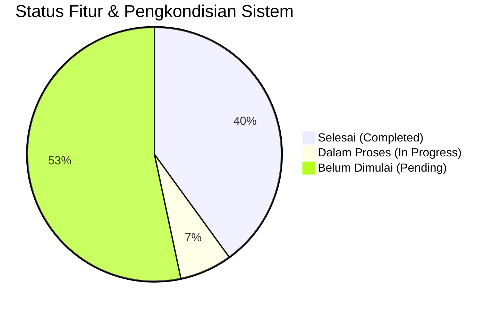

# PROGRESS PENGEMBANGAN SISTEM PRESENSI DIGITAL PKBM PIKAT

**Tanggal Pembaruan:** 14 September 2026  
**Status Proyek:** Fase 1 (Keamanan, Infrastruktur, Standardisasi & Fondasi Sistem)  
**Versi Framework:** Laravel 13.31.0 (PHP 8.5.1)  
**Repositori Remote:** `https://github.com/4lliiifffff/pengembangan-presensi-pkbmpikat.git` (Branch: `main`)  

---

## 📊 RINGKASAN PROGRESS KESELURUHAN

| Kategori | Jumlah Item Roadmap | Selesai (🟢) | Dalam Proses (🟡) | Belum Dimulai (⚪) |
|---|---|---|---|---|
| 1. Keamanan & Infrastruktur | 5 | 3 | 0 | 2 |
| 2. Core Presensi & Validasi | 7 | 1 | 1 | 5 |
| 3. Payroll & Honorarium | 4 | 0 | 0 | 4 |
| 4. Integrasi & Notifikasi | 4 | 0 | 0 | 4 |
| 5. Executive Dashboard | 3 | 0 | 0 | 3 |
| 6. Codebase, Standardisasi & QA | 6 | 5 | 1 | 0 |
| **Tambahan (Infrastruktur Teknis)** | **3** | **3** | **0** | **0** |

---

## 🚀 1. DETAIL PROGRESS BERDASARKAN ROADMAP PENGEMBANGAN

### 1. Keamanan, Infrastruktur & Performa (System Hardening)
- 🟢 **1.1 Perbaikan Deprecation Warning PHP 8.5**
  - **Status:** **SELESAI**
  - **Rincian Implementasi:** Memperbarui `config/database.php` pada opsi koneksi `mysql` dan `mariadb` menggunakan pengecekan dinamis `(defined('Pdo\Mysql::ATTR_SSL_CA') ? Pdo\Mysql::ATTR_SSL_CA : PDO::MYSQL_ATTR_SSL_CA)` untuk menggantikan konstanta `PDO::MYSQL_ATTR_SSL_CA` yang *deprecated* di PHP 8.5.
- 🟢 **1.2 Pembersihan Log & Pengamanan File Server**
  - **Status:** **SELESAI**
  - **Rincian Implementasi:** Membuang file `error_log` liar bawaan server Apache/cPanel dari seluruh sub-direktori proyek dan memperbarui `.gitignore` agar tidak melacak file log/temporary.
- 🟢 **1.3 Perbaikan Environment Server Worker & Configuration**
  - **Status:** **SELESAI**
  - **Rincian Implementasi:** Mengatur `PHP_CLI_SERVER_WORKERS=1` dan memperbarui `APP_URL=http://localhost` pada file `.env` untuk memastikan pengujian rute HTTP dan server reloader berjalan lancar.
- ⚪ **1.4 Rate Limiting Login**
  - **Status:** *Pending* (Rencana penerapan Laravel `RateLimiter` pada rute autentikasi).
- ⚪ **1.5 Secure Storage Foto Presensi (Private Storage & Signed URLs)**
  - **Status:** *Pending* (Rencana pemindahan foto presensi sensitif ke `storage/app/private/` dengan akses URL bertanda tangan).
- ⚪ **1.6 Script Deployment Otomatis (CI/CD Pipeline)**
  - **Status:** *Pending* (Rencana setup GitHub Actions workflow).

---

### 2. Pengembangan Fitur Inti Presensi (Attendance Core Enhancement)
- 🟢 **2.1 Standardisasi Storage Abstraction & Management Foto Presensi**
  - **Status:** **SELESAI**
  - **Rincian Implementasi:** 
    - Mengabstraksi seluruh controller upload foto (`ProfileController`, `KaryawanController`, `PresensiFotoController`, `KaryawanPresensiController`) menggunakan Laravel `Storage::disk('public')->putFileAs()`.
    - Memindahkan seluruh foto legacy dari `public/uploads/` ke `storage/app/public/uploads/` dan menghapus direktori `public/uploads/` sepenuhnya dari web root.
    - Menambahkan Eloquent Accessors (`$user->foto_url`, `$presensi->foto_mulai_url`, `$presensi->foto_selesai_url`) pada model `User`, `Presensi`, dan `PresensiKaryawan` untuk menjamin 100% *backward compatibility*.
- 🟡 **2.2 Workflow Digital Lupa Lapor (Approval Kepala Sekolah)**
  - **Status:** **DALAM PROSES**
  - **Rincian Implementasi:** Model `Lapor_Lapor`, controller `Tutor\LupaLaporController`, dan tabel migrasi sudah tersedia. Selanjutnya akan disempurnakan untuk auto-upsert rekapitulasi kehadiran dan notifikasi Kepala Sekolah.
- ⚪ **2.3 Geofencing & Validasi Lokasi (Haversine & Anti Fake GPS)**
  - **Status:** *Pending*.
- ⚪ **2.4 Verifikasi Wajah Otomatis (Face AI / Gemini Vision)**
  - **Status:** *Pending*.
- ⚪ **2.5 PWA (Progressive Web App) & Offline Mode**
  - **Status:** *Pending*.
- ⚪ **2.6 Pengajuan Izin & Sakit Mandiri oleh Tutor**
  - **Status:** *Pending*.

---

### 3. Integrasi Manajemen Penggajian & Honorarium (Payroll System)
- ⚪ **3.1 Otomatisasi Perhitungan Honor Mengajar Tutor**
  - **Status:** *Pending*.
- ⚪ **3.2 Slip Gaji Digital & Generasi Laporan Keuangan (PDF)**
  - **Status:** *Pending*.

---

### 4. Integrasi Interoperabilitas Sistem & Notifikasi
- ⚪ **4.1 Single Sign-On (SSO via Sanctum/OAuth2) & SIM PKBM Pikat**
  - **Status:** *Pending* (Tabel `personal_access_tokens` dan `laravel/sanctum` sudah terinstal).
- ⚪ **4.2 Integrasi WhatsApp Gateway (Notifikasi Real-time)**
  - **Status:** *Pending*.
- ⚪ **4.3 Import & Export Massal Data (Excel/CSV via Maatwebsite)**
  - **Status:** *Pending* (Paket `maatwebsite/excel` sudah terinstal & terdaftar).

---

### 5. Executive Dashboard & Business Intelligence
- ⚪ **5.1 Dashboard Analytics Kepala Sekolah (Heatmap & KPI)**
  - **Status:** *Pending*.
- ⚪ **5.2 Laporan Standar Akreditasi BAN PAUD & PNF**
  - **Status:** *Pending*.

---

### 6. Refactored Codebase, Standardisasi & Quality Assurance
- 🟢 **6.1 Formatting Standard Codebase (Laravel Pint)**
  - **Status:** **SELESAI**
  - **Rincian Implementasi:** Menjalankan `vendor/bin/pint` pada seluruh file controller, model, view, seeder, dan migration untuk memastikan kesesuaian gaya penulisan kode (*PSR-12 / Laravel Code Style*).
- 🟢 **6.2 Standardisasi Bahasa Indonesia & Lokalisasi Sistem**
  - **Status:** **SELESAI**
  - **Rincian Implementasi:** Melakukan standardisasi seluruh teks UI, nama modul, format tanggal (Carbon locale `id`), status presensi, dan pesan validasi/flash message ke dalam Bahasa Indonesia yang baku dan konsisten.
- 🟢 **6.3 Sentralisasi Design System via `resources/css/app.css`**
  - **Status:** **SELESAI**
  - **Rincian Implementasi:** Menyatukan seluruh styling CSS komponen ke dalam `resources/css/app.css`, menghapus seluruh inline `<style>` dari view Blade, membuang folder CSS statis redundan (`public/css/` & `public/assets/css/`), dan merapikan rujukan layout agar 100% Vite native (`@vite(['resources/css/app.css', 'resources/js/app.js'])`).
- 🟢 **6.4 Restrukturisasi & Standardisasi Folder Views (`resources/views/layouts/`)**
  - **Status:** **SELESAI**
  - **Rincian Implementasi:** 
    - Mengonsolidasikan folder `layout/` (singular) dan `layouts/` (plural) menjadi `resources/views/layouts/`.
    - Memisahkan komponen partial navigasi berbahasa Indonesia di [`resources/views/layouts/components/`](file:///c:/laragon/www/pengembangan-presensi-pikat/resources/views/layouts/components) (`navigasi_atas.blade.php`, `navigasi_bawah_admin.blade.php`, `navigasi_bawah_kepsek.blade.php`, `navigasi_bawah_tutor.blade.php`).
    - Memperbarui 29 file view Blade ke `@extends('layouts.x')`.
    - Membersihkan file *dead-code* (`welcome.blade.php`, `buttomNav.blade.php`, `navbar.blade.php`, `script.blade.php`).
- 🟢 **6.5 Automated Testing & Verification Suite**
  - **Status:** **SELESAI**
  - **Rincian Implementasi:** Menjalankan pengujian automated test `vendor/bin/phpunit` (2 tests, 2 assertions OK) dan kompilasi build produksi Vite `npm run build`.
- 🟡 **6.6 Refactoring Pattern DRY (Service & Repository Classes)**
  - **Status:** **DALAM PROSES**

---

## 🛠️ 2. PERUBAHAN & PENGKONDISIAN TEKNIS (INFRASTRUKTUR & VCS)

| No | Nama Perubahan / Fitur | Kategori | Deskripsi & Dampak | Status |
|---|---|---|---|---|
| 1 | **Inisialisasi Remote Repositori Git** | Git & VCS | Membuat repositori Git baru, mengatur branch utama ke `main`, menambahkan remote `origin` (`https://github.com/4lliiifffff/pengembangan-presensi-pkbmpikat.git`), dan melakukan commit/push awal. | 🟢 Selesai |
| 2 | **Migrasi Baseline Codebase `presensi-pkbmpikat`** | Core Setup | Memindahkan seluruh kode proyek lama (Controller, Models, Views, Migrations, Seeders, Assets, Config) ke dalam repositori pengembangan baru `pengembangan-presensi-pikat`. | 🟢 Selesai |
| 3 | **Penyesuaian Kompatibilitas Dependensi PHP 8.5** | Environment | Mengonfigurasi `composer.json` dan menjalankan `composer install --ignore-platform-req=php` agar paket-paket seperti `phpoffice/phpspreadsheet`, `maatwebsite/excel`, dan `barryvdh/laravel-dompdf` berjalan lancar di PHP 8.5. | 🟢 Selesai |
| 4 | **Pemasangan & Konfigurasi Laravel Boost MCP** | AI & Tooling | Menginstal dependensi dev `laravel/boost` dan mengonfigurasi file `AGENTS.md` serta aturan pendukung untuk integrasi AI coding assistant yang optimal. | 🟢 Selesai |

---

## 📌 3. REKAPITULASI DOKUMEN & ACTION PLAN SELANJUTNYA

### Item yang Siap Dikerjakan Berikutnya (Next Immediate Tasks):
1. **[Fase 1] Penambahan Rate Limiting Login**: Menambahkan middleware `throttle:login` di rute `routes/web.php` & `routes/api.php`.
2. **[Fase 1 & 2] Secure Storage Foto Presensi**: Membuat private disk dan endpoint pengaksesan foto berbasis *Signed URL*.
3. **[Fase 2] Penyempurnaan Workflow Lupa Lapor**: Menghubungkan persetujuan Lupa Lapor oleh Kepala Sekolah langsung ke pembaruan (*upsert*) tabel `presensis`.
