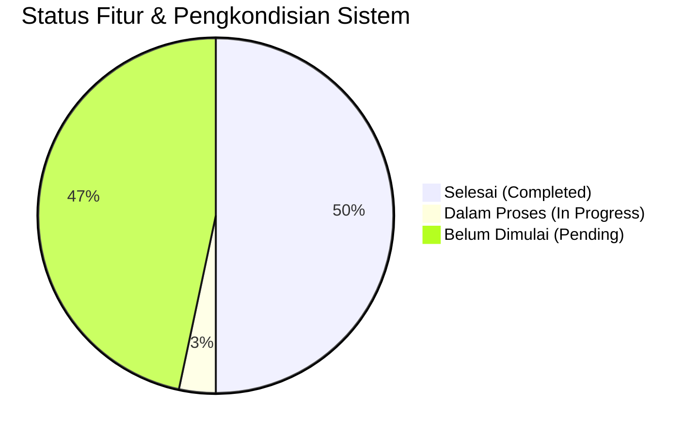

# PROGRESS PENGEMBANGAN SISTEM PRESENSI DIGITAL PKBM PIKAT

**Tanggal Pembaruan:** 14 September 2026  
**Versi Framework:** Laravel 13.31.0 (PHP 8.5.1)  
**Status Proyek:** Fase 1 & 2 (Keamanan, Infrastruktur, Presensi Multi-Moda & Workflow Approval)  
**Repositori Remote:** `https://github.com/4lliiifffff/pengembangan-presensi-pkbmpikat.git` (Branch: `main`)  

---

## 📊 RINGKASAN PROGRESS KESELURUHAN

| Kategori | Jumlah Item Roadmap | Selesai (🟢) | Dalam Proses (🟡) | Belum Dimulai (⚪) |
|---|---|---|---|---|
| 1. Keamanan, Infrastruktur & Performa | 7 | 5 | 0 | 2 |
| 2. Core Presensi & Validasi | 7 | 3 | 0 | 4 |
| 3. Payroll & Honorarium | 4 | 0 | 0 | 4 |
| 4. Integrasi & Notifikasi | 4 | 0 | 0 | 4 |
| 5. Executive Dashboard | 3 | 0 | 0 | 3 |
| 6. Codebase, Standardisasi & QA | 5 | 4 | 1 | 0 |
| **Tambahan (Infrastruktur Teknis)** | **3** | **3** | **0** | **0** |

---

## 🚀 1. DETAIL PROGRESS BERDASARKAN ROADMAP PENGEMBANGAN

### 1. Keamanan, Infrastruktur & Performa (System Hardening)

#### 1.1 Keamanan Autentikasi & Akses Berkas
- 🟢 **Upgrade Framework Laravel 13 (v13.31.0)**
  - **Status:** **SELESAI**
  - **Rincian Implementasi:** Memperbarui `composer.json` ke `"laravel/framework": "^13.0"` dan `"laravel/tinker": "^3.0"`, menyelaraskan dependensi `nunomaduro/collision`, serta meregenerasi autoloader sehingga aplikasi berjalan stabil di atas versi Laravel 13 terbaru (v13.31.0).
- 🟢 **Perbaikan Deprecation Warning PHP 8.5**
  - **Status:** **SELESAI**
  - **Rincian Implementasi:** Memperbarui `config/database.php` pada opsi koneksi `mysql` dan `mariadb` menggunakan pengecekan dinamis `(defined('Pdo\Mysql::ATTR_SSL_CA') ? Pdo\Mysql::ATTR_SSL_CA : PDO::MYSQL_ATTR_SSL_CA)` untuk menggantikan konstanta `PDO::MYSQL_ATTR_SSL_CA` yang *deprecated* di PHP 8.5+.
- 🟢 **Mekanisme Rate Limiting Login**
  - **Status:** **SELESAI**
  - **Rincian Implementasi:** Menambahkan pembatasan percobaan login (maksimal 5 kali per menit per IP/akun) menggunakan Laravel `RateLimiter` dan middleware `throttle:login` di `routes/web.php` & `routes/api.php` untuk mencegah serangan *Brute Force*, dilengkapi respon ramah (pesan peringatan web & HTTP 429 JSON API) serta pembersihan counter saat login berhasil.
- ⚪ **Secure Storage Foto Presensi (Private Storage & Signed URLs)**
  - **Status:** **PENDING**
  - **Rincian Implementasi:** Pemindahan direktori foto presensi sensitif ke `storage/app/private/` dengan pengaksesan via *Temporary Signed URL* yang mewajibkan autentikasi pengguna dan pembatasan waktu akses.

#### 1.2 Manajemen Log & Infrastruktur Server
- 🟢 **Pembersihan & Pengamanan File Error Log**
  - **Status:** **SELESAI**
  - **Rincian Implementasi:** Membuang file `error_log` liar bawaan server cPanel/Apache, mengalokasikan direktori log ke `storage/logs/`, dan menambahkan pola `error_log` pada `.gitignore` agar tidak mengekspos credential dan log di repositori Git.
- 🟢 **Environment Worker & Config Tuning**
  - **Status:** **SELESAI**
  - **Rincian Implementasi:** Mengatur `PHP_CLI_SERVER_WORKERS=1` dan `APP_URL=http://localhost` pada file `.env` untuk konsistensi server reloader dan pengujian rute HTTP.
- ⚪ **Penerapan Script Deployment Otomatis (CI/CD Pipeline)**
  - **Status:** **PENDING**
  - **Rincian Implementasi:** Pembuatan script *post-deploy* (misal via GitHub Actions) yang otomatis menjalankan `composer install --no-dev`, `php artisan config:cache`, `php artisan route:cache`, dan `php artisan migrate --force`.

---

### 2. Pengembangan Fitur Inti Presensi (Attendance Core Enhancement)

#### 2.1 Storage Abstraction & Management Foto Presensi
- 🟢 **Abstraksi Storage Disk Public & Model Accessor**
  - **Status:** **SELESAI**
  - **Rincian Implementasi:** 
    - Mengabstraksi seluruh controller upload foto (`ProfileController`, `KaryawanController`, `PresensiFotoController`, `KaryawanPresensiController`) menggunakan Laravel `Storage::disk('public')->putFileAs()`.
    - Memindahkan seluruh foto legacy dari `public/uploads/` ke `storage/app/public/uploads/` dan menghapus direktori `public/uploads/` sepenuhnya dari web root.
    - Menambahkan Eloquent Accessors (`$user->foto_url`, `$presensi->foto_mulai_url`, `$presensi->foto_selesai_url`) pada model `User`, `Presensi`, dan `PresensiKaryawan` untuk menjamin 100% *backward compatibility*.

#### 2.2 Workflow Digital Lupa Lapor (Retroactive Attendance Approval)
- 🟢 **Persetujuan Interaktif Kepala Sekolah**
  - **Status:** **SELESAI**
  - **Rincian Implementasi:** 
    - Restrukturisasi dan standardisasi nama model menjadi **`PengajuanLupaLapor`** dengan tabel **`pengajuan_lupa_lapor`** (menggantikan nama legacy `Lapor_Lapor` / `lapor__lapors`).
    - Menambahkan status persetujuan (`pending`, `disetujui`, `ditolak`) dan kolom `catatan_kepsek`.
    - Menyempurnakan alur pengajuan oleh Tutor serta persetujuan interaktif oleh Kepala Sekolah.
    - **Otomatisasi Rekap Presensi**: Ketika Kepala Sekolah mengklik "Setujui", sistem secara otomatis melakukan *upsert* (membuat/memperbarui) data kehadiran pada tabel `presensis` (`status = 'hadir'`).

#### 2.3 Validasi Lokasi & Fitur Lanjutan
- 🟢 **Presensi Multi-Moda (Sekolah, Kunjungan Rumah, Online)**
  - **Status:** **SELESAI**
  - **Rincian Implementasi:** 
    - Menambahkan kolom `moda_pembelajaran` (`sekolah`, `kunjungan_rumah`, `online`) dan `link_daring` pada tabel `presensis`.
    - Mengintegrasikan pemilih moda pembelajaran pada form presensi tutor (`tutor/presensi_foto.blade.php`).
    - **Tatap Muka Sekolah**: Strict Geofencing dari titik sekolah PKBM Pikat.
    - **Kunjungan Rumah (Home Visit)**: Catat titik lokasi GPS kunjungan + foto di rumah murid.
    - **Pembelajaran Online**: Bypass radius lokasi + wajib melampirkan foto layar/link ruang pertemuan (Zoom/GMeet).
    - Menambahkan Eloquent Accessor `$presensi->moda_label` untuk kemudahan pelaporan.
- ⚪ **Kalkulasi Radius Geofencing (Rumus Haversine)**
  - **Status:** **PENDING**
  - **Rincian Implementasi:** Membatasi absen masuk/pulang berdasarkan koordinat GPS tutor dengan toleransi radius $\le 100$ meter dari titik lokasi PKBM Pikat menggunakan algoritma rumus Haversine.
- ⚪ **Deteksi Manipulasi GPS (Anti Fake GPS)**
  - **Status:** **PENDING**
  - **Rincian Implementasi:** Integrasi validasi *accuracy level* lokasi browser/device dan deteksi penggunaan aplikasi *mock location* atau manipulasi koordinat GPS.
- ⚪ **Verifikasi Wajah Otomatis (Face Matching / AI Recognition)**
  - **Status:** **PENDING**
  - **Rincian Implementasi:** Mengintegrasikan pemrosesan AI (misal: Face-API.js / TensorFlow) untuk membandingkan foto presensi tutor secara real-time dengan foto profil master.
- ⚪ **PWA (Progressive Web App) & Offline Mode**
  - **Status:** **PENDING**
  - **Rincian Implementasi:** Pemasangan Web App Manifest, Service Worker, dan penyimpanan lokal `IndexedDB` agar presensi tetap dapat dicatat saat perangkat tidak memiliki sinyal internet dan otomatis melakukan sinkronisasi saat online.
- ⚪ **Pengajuan Izin & Sakit Mandiri oleh Tutor**
  - **Status:** **PENDING**
  - **Rincian Implementasi:** Modul pengajuan izin dan sakit digital oleh Tutor lengkap dengan upload surat keterangan/dokumen pendukung serta alur verifikasi approval oleh Admin/Kepala Sekolah.

---

### 3. Integrasi Manajemen Penggajian & Honorarium (Payroll System)

#### 3.1 Otomatisasi Perhitungan Honor Mengajar Tutor
- ⚪ **Kalkulasi Honorarium Berbasis Presensi Valid**
  - **Status:** **PENDING**
  - **Rincian Implementasi:** Menghitung akumulasi jam mengajar terverifikasi secara otomatis per periode bulan dikalikan dengan besaran tarif honor per jam / per sesi kehadiran.
- ⚪ **Dukungan Multitarif**
  - **Status:** **PENDING**
  - **Rincian Implementasi:** Fleksibilitas konfigurasi tarif honorarium yang bervariasi berdasarkan jenjang kelas (PAUD/Kesetaraan), kategori mata pelajaran, dan kualifikasi Tutor.

#### 3.2 Slip Gaji Digital & Generasi Laporan Keuangan
- ⚪ **Ekspor Slip Gaji PDF**
  - **Status:** **PENDING**
  - **Rincian Implementasi:** Otomatisasi pembentukan dokumen Slip Gaji individual Tutor dalam format PDF (menggunakan `barryvdh/laravel-dompdf`) yang dapat diunduh langsung dari dashboard Tutor.
- ⚪ **Modul Rekapitulasi Anggaran**
  - **Status:** **PENDING**
  - **Rincian Implementasi:** Laporan komprehensif pengeluaran anggaran honorarium tutor harian, mingguan, dan bulanan bagi manajemen lembaga.

---

### 4. Integrasi Interoperabilitas Sistem & Notifikasi (Integrations)

#### 4.1 Single Sign-On (SSO) & Integrasi SIM PKBM Pikat
- ⚪ **Integrasi Akun Terpusat (SSO via Laravel Sanctum / OAuth2)**
  - **Status:** **PENDING**
  - **Rincian Implementasi:** Menghubungkan autentikasi dan basis data pengguna antara Sistem Presensi Digital dan SIM PKBM Pikat menggunakan API Tokens (Laravel Sanctum) atau OAuth2.

#### 4.2 Integrasi WhatsApp Gateway (Notifikasi Real-Time)
- ⚪ **Notifikasi Pengingat Absen (Reminder)**
  - **Status:** **PENDING**
  - **Rincian Implementasi:** Pengiriman pesan WhatsApp pengingat secara otomatis kepada Tutor yang belum melakukan *Clock-In* atau *Clock-Out* sesuai jadwal mengajar.
- ⚪ **Laporan Ketersediaan Tutor ke Wali Murid**
  - **Status:** **PENDING**
  - **Rincian Implementasi:** Pesan notifikasi real-time ke WhatsApp orang tua/wali murid saat Tutor terkonfirmasi hadir dan memulai sesi kegiatan belajar mengajar.

#### 4.3 Import & Export Massal Data (Bulk Data Management)
- ⚪ **Import Spreadsheet Excel/CSV**
  - **Status:** **PENDING**
  - **Rincian Implementasi:** Fitur pengunggahan massal (*bulk import*) data Tutor, siswa, jadwal mengajar, dan pembagian kelas menggunakan paket `maatwebsite/excel`.

---

### 5. Executive Dashboard & Business Intelligence (Analytics)

#### 5.1 Dashboard Analytics Kepala Sekolah
- ⚪ **Heatmap Kehadiran & Tren Kinerja**
  - **Status:** **PENDING**
  - **Rincian Implementasi:** Visualisasi grafik interaktif (Chart.js / ApexCharts) untuk memantau tren tingkat kehadiran Tutor per bulan, persebaran keterlambatan, dan keaktifan mengajar.
- ⚪ **Indikator Kinerja Utama (KPI Tutor)**
  - **Status:** **PENDING**
  - **Rincian Implementasi:** Pemeringkatan kedisiplinan dan akumulasi jam mengajar Tutor sebagai acuan evaluasi kinerja tahunan oleh Kepala Sekolah.

#### 5.2 Laporan Standar Akreditasi Pendidikan
- ⚪ **Format Laporan Otomatis Akreditasi BAN PAUD & PNF**
  - **Status:** **PENDING**
  - **Rincian Implementasi:** Fitur generasi laporan rekapitulasi presensi dan kegiatan mengajar yang sudah disesuaikan dengan format standar lampiran akreditasi BAN PAUD & PNF.

---

### 6. Refactored Codebase, Standardisasi & Testing (Quality Assurance)

#### 6.1 Restrukturisasi & Standardisasi System Codebase
- 🟢 **Standardisasi Penulisan Kode (Laravel Pint)**
  - **Status:** **SELESAI**
  - **Rincian Implementasi:** Menjalankan `vendor/bin/pint` pada seluruh file controller, model, view, seeder, dan migration untuk memastikan kesesuaian gaya penulisan kode (*PSR-12 / Laravel Code Style*).
- 🟢 **Standardisasi Bahasa Indonesia & Lokalisasi System**
  - **Status:** **SELESAI**
  - **Rincian Implementasi:** Melakukan standardisasi seluruh teks UI, nama modul, format tanggal Carbon locale `id`, status presensi, dan pesan validasi/flash message ke dalam Bahasa Indonesia yang baku dan konsisten.
- 🟢 **Sentralisasi Design System via `resources/css/app.css`**
  - **Status:** **SELESAI**
  - **Rincian Implementasi:** Menyatukan seluruh styling CSS komponen ke dalam `resources/css/app.css`, menghapus seluruh inline `<style>` dari view Blade, membuang folder CSS statis redundan (`public/css/` & `public/assets/css/`), dan merapikan rujukan layout agar 100% Vite native (`@vite(['resources/css/app.css', 'resources/js/app.js'])`).
- 🟢 **Restrukturisasi & Standardisasi Folder Views (`resources/views/layouts/`)**
  - **Status:** **SELESAI**
  - **Rincian Implementasi:** 
    - Mengonsolidasikan folder `layout/` (singular) dan `layouts/` (plural) menjadi `resources/views/layouts/`.
    - Memisahkan komponen partial navigasi berbahasa Indonesia di [`resources/views/layouts/components/`](file:///c:/laragon/www/pengembangan-presensi-pikat/resources/views/layouts/components) (`navigasi_atas`, `navigasi_bawah_admin`, `navigasi_bawah_kepsek`, `navigasi_bawah_tutor`).
    - Memperbarui 29 file view Blade ke `@extends('layouts.x')`.
    - Membersihkan file *dead-code* (`welcome.blade.php`, `buttomNav.blade.php`, `navbar.blade.php`, `script.blade.php`).

#### 6.2 Pengujian Otomatis (Automated Testing Suite) & Verification
- 🟢 **Automated Testing Suite (PHPUnit) & Build Validation**
  - **Status:** **SELESAI**
  - **Rincian Implementasi:** Menjalankan pengujian automated test `vendor/bin/phpunit` (7 tests, 26 assertions OK) dan kompilasi build produksi Vite `npm run build`.
- 🟡 **Penerapan Pattern DRY (Service & Repository Pattern)**
  - **Status:** **DALAM PROSES**
  - **Rincian Implementasi:** Refactoring dan pemisahan logika bisnis dari Controller ke Service Classes (misal: `PresensiService`, `PayrollService`) untuk menghindari kode berulang (*DRY - Don't Repeat Yourself*).

---

## 🛠️ 2. PERUBAHAN & PENGKONDISIAN TEKNIS (INFRASTRUKTUR & VCS)

| No | Nama Perubahan / Fitur | Kategori | Deskripsi & Dampak | Status |
|---|---|---|---|---|
| 1 | **Inisialisasi Remote Repositori Git** | Git & VCS | Membuat repositori Git baru, mengatur branch utama ke `main`, menambahkan remote `origin` (`https://github.com/4lliiifffff/pengembangan-presensi-pkbmpikat.git`), dan melakukan commit/push awal. | 🟢 Selesai |
| 2 | **Migrasi Baseline Codebase `presensi-pkbmpikat`** | Core Setup | Memindahkan seluruh kode proyek lama (Controller, Models, Views, Migrations, Seeders, Assets, Config) ke dalam repositori pengembangan baru `pengembangan-presensi-pikat`. | 🟢 Selesai |
| 3 | **Penyesuaian Kompatibilitas Dependensi PHP 8.5** | Environment | Mengonfigurasi `composer.json` dan menjalankan `composer install --ignore-platform-req=php` agar paket-paket seperti `phpoffice/phpspreadsheet`, `maatwebsite/excel`, dan `barryvdh/laravel-dompdf` berjalan lancar di PHP 8.5. | 🟢 Selesai |
| 4 | **Pemasangan & Konfigurasi Laravel Boost MCP** | AI & Tooling | Menginstal dependensi dev `laravel/boost` dan mengonfigurasi file `AGENTS.md` serta aturan pendukung untuk integrasi AI coding assistant yang optimal. | 🟢 Selesai |

---

## 📌 3. REKAPITULASI DOKUMEN & ACTION PLAN SELANJUTNYA

### Item yang Siap Dikerjakan Berikutnya (Next Immediate Tasks):
1. **[Fase 1 & 2] Secure Storage Foto Presensi**: Membuat private disk dan endpoint pengaksesan foto berbasis *Signed URL*.
2. **[Fase 2] Kalkulasi Radius Geofencing**: Membatasi lokasi presensi tutor berdasarkan radius GPS menggunakan rumus Haversine.
