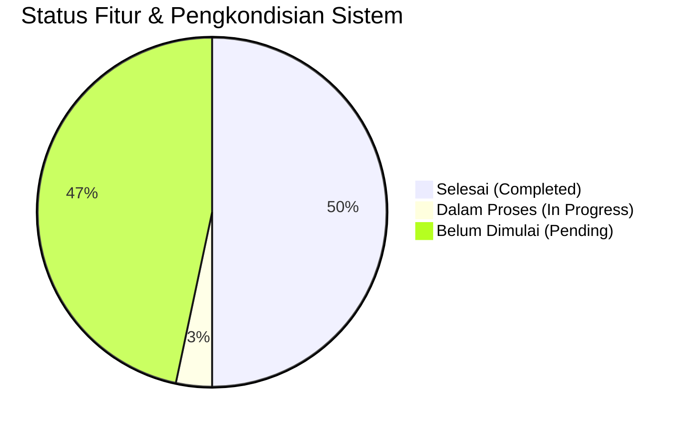

# PROGRESS PENGEMBANGAN SISTEM PRESENSI DIGITAL PKBM PIKAT

**Tanggal Pembaruan:** 14 September 2026  
**Versi Framework:** Laravel 13.31.0 (PHP 8.5.1)  
**Status Proyek:** Fase 1 & 2 (Keamanan, Infrastruktur, Presensi Multi-Moda & Workflow Approval)  
**Repositori Remote:** `https://github.com/4lliiifffff/pengembangan-presensi-pkbmpikat.git` (Branch: `main`)  

---

## 📊 RINGKASAN PROGRESS KESELURUHAN

| Kategori | Jumlah Item Roadmap | Selesai (🟢) | Dalam Proses (🟡) | Belum Dimulai (⚪) |
|---|---|---|---|---|
| 1. Keamanan, Infrastruktur & Performa | 7 | 5 | 0 | 2 |
| 2. Core Presensi & Validasi | 7 | 3 | 0 | 4 |
| 3. Payroll & Honorarium | 4 | 0 | 0 | 4 |
| 4. Integrasi & Notifikasi | 4 | 0 | 0 | 4 |
| 5. Executive Dashboard | 3 | 0 | 0 | 3 |
| 6. Codebase, Standardisasi & QA | 5 | 4 | 1 | 0 |
| **Tambahan (Infrastruktur Teknis)** | **3** | **3** | **0** | **0** |

---

## 🚀 1. DETAIL PROGRESS BERDASARKAN ROADMAP PENGEMBANGAN

### 1. Keamanan, Infrastruktur & Performa (System Hardening)

#### 1.1 Keamanan Autentikasi & Akses Berkas
- 🟢 **Upgrade Framework Laravel 13 (v13.31.0)**
  - **Status:** **SELESAI**
  - **Rincian Implementasi:** Memperbarui `composer.json` ke `"laravel/framework": "^13.0"` dan `"laravel/tinker": "^3.0"`, menyelaraskan dependensi `nunomaduro/collision`, serta meregenerasi autoloader sehingga aplikasi berjalan stabil di atas versi Laravel 13 terbaru (v13.31.0).
- 🟢 **Perbaikan Deprecation Warning PHP 8.5**
  - **Status:** **SELESAI**
  - **Rincian Implementasi:** Memperbarui `config/database.php` pada opsi koneksi `mysql` dan `mariadb` menggunakan pengecekan dinamis `(defined('Pdo\Mysql::ATTR_SSL_CA') ? Pdo\Mysql::ATTR_SSL_CA : PDO::MYSQL_ATTR_SSL_CA)` untuk menggantikan konstanta `PDO::MYSQL_ATTR_SSL_CA` yang *deprecated* di PHP 8.5+.
- 🟢 **Mekanisme Rate Limiting Login**
  - **Status:** **SELESAI**
  - **Rincian Implementasi:** Menambahkan pembatasan percobaan login (maksimal 5 kali per menit per IP/akun) menggunakan Laravel `RateLimiter` dan middleware `throttle:login` di `routes/web.php` & `routes/api.php` untuk mencegah serangan *Brute Force*, dilengkapi respon ramah (pesan peringatan web & HTTP 429 JSON API) serta pembersihan counter saat login berhasil.
- ⚪ **Secure Storage Foto Presensi (Private Storage & Signed URLs)**
  - **Status:** **PENDING**
  - **Rincian Implementasi:** Pemindahan direktori foto presensi sensitif ke `storage/app/private/` dengan pengaksesan via *Temporary Signed URL* yang mewajibkan autentikasi pengguna dan pembatasan waktu akses.

#### 1.2 Manajemen Log & Infrastruktur Server
- 🟢 **Pembersihan & Pengamanan File Error Log**
  - **Status:** **SELESAI**
  - **Rincian Implementasi:** Membuang file `error_log` liar bawaan server cPanel/Apache, mengalokasikan direktori log ke `storage/logs/`, dan menambahkan pola `error_log` pada `.gitignore` agar tidak mengekspos credential dan log di repositori Git.
- 🟢 **Environment Worker & Config Tuning**
  - **Status:** **SELESAI**
  - **Rincian Implementasi:** Mengatur `PHP_CLI_SERVER_WORKERS=1` dan `APP_URL=http://localhost` pada file `.env` untuk konsistensi server reloader dan pengujian rute HTTP.
- ⚪ **Penerapan Script Deployment Otomatis (CI/CD Pipeline)**
  - **Status:** **PENDING**
  - **Rincian Implementasi:** Pembuatan script *post-deploy* (misal via GitHub Actions) yang otomatis menjalankan `composer install --no-dev`, `php artisan config:cache`, `php artisan route:cache`, dan `php artisan migrate --force`.

---

### 2. Pengembangan Fitur Inti Presensi (Attendance Core Enhancement)

#### 2.1 Storage Abstraction & Management Foto Presensi
- 🟢 **Abstraksi Storage Disk Public & Model Accessor**
  - **Status:** **SELESAI**
  - **Rincian Implementasi:** 
    - Mengabstraksi seluruh controller upload foto (`ProfileController`, `KaryawanController`, `PresensiFotoController`, `KaryawanPresensiController`) menggunakan Laravel `Storage::disk('public')->putFileAs()`.
    - Memindahkan seluruh foto legacy dari `public/uploads/` ke `storage/app/public/uploads/` dan menghapus direktori `public/uploads/` sepenuhnya dari web root.
    - Menambahkan Eloquent Accessors (`$user->foto_url`, `$presensi->foto_mulai_url`, `$presensi->foto_selesai_url`) pada model `User`, `Presensi`, dan `PresensiKaryawan` untuk menjamin 100% *backward compatibility*.

#### 2.2 Workflow Digital Lupa Lapor (Retroactive Attendance Approval)
- 🟢 **Persetujuan Interaktif Kepala Sekolah**
  - **Status:** **SELESAI**
  - **Rincian Implementasi:** 
    - Restrukturisasi dan standardisasi nama model menjadi **`PengajuanLupaLapor`** dengan tabel **`pengajuan_lupa_lapor`** (menggantikan nama legacy `Lapor_Lapor` / `lapor__lapors`).
    - Menambahkan status persetujuan (`pending`, `disetujui`, `ditolak`) dan kolom `catatan_kepsek`.
    - Menyempurnakan alur pengajuan oleh Tutor serta persetujuan interaktif oleh Kepala Sekolah.
    - **Otomatisasi Rekap Presensi**: Ketika Kepala Sekolah mengklik "Setujui", sistem secara otomatis melakukan *upsert* (membuat/memperbarui) data kehadiran pada tabel `presensis` (`status = 'hadir'`).

#### 2.3 Validasi Lokasi & Fitur Lanjutan
- 🟢 **Presensi Multi-Moda (Sekolah, Kunjungan Rumah, Online)**
  - **Status:** **SELESAI**
  - **Rincian Implementasi:** 
    - Menambahkan kolom `moda_pembelajaran` (`sekolah`, `kunjungan_rumah`, `online`) dan `link_daring` pada tabel `presensis`.
    - Mengintegrasikan pemilih moda pembelajaran pada form presensi tutor (`tutor/presensi_foto.blade.php`).
    - **Tatap Muka Sekolah**: Strict Geofencing dari titik sekolah PKBM Pikat.
    - **Kunjungan Rumah (Home Visit)**: Catat titik lokasi GPS kunjungan + foto di rumah murid.
    - **Pembelajaran Online**: Bypass radius lokasi + wajib melampirkan foto layar/link ruang pertemuan (Zoom/GMeet).
    - Menambahkan Eloquent Accessor `$presensi->moda_label` untuk kemudahan pelaporan.
- 🟢 **Kalkulasi Radius Geofencing (Rumus Haversine) & Visualisasi Peta Interaktif**
  - **Status:** **SELESAI**
  - **Rincian Implementasi:**
    - Membuat service class `App\Services\GeofencingService` dengan fungsi `calculateDistance()` menggunakan **Rumus Haversine** untuk menghitung jarak antara dua pasang koordinat GPS (latitude/longitude) dalam satuan meter.
    - Menambahkan titik koordinat sekolah PKBM Pikat (`sekolah_lat`, `sekolah_lng`) dan toleransi radius (`radius_meter` = 100m) pada file konfigurasi `config/lokasi.php` dan file environment `.env`.
    - Mengintegrasikan pemeriksaan geofencing pada `PresensiFotoController::store()` untuk moda pembelajaran `sekolah`. Jika jarak GPS tutor dengan titik sekolah PKBM Pikat $> 100$ meter, presensi otomatis ditolak dengan pesan peringatan interaktif yang menampilkan jarak sebenarnya.
    - **Visualisasi Peta Leaflet.js**: Menampilkan lingkaran transparan radius 100 meter sekeliling sekolah PKBM Pikat dengan warna dinamis (Hijau = di dalam radius, Merah = di luar radius), penanda pin marker sekolah & posisi tutor, serta auto-zoom fit bounds.
    - Pengujian otomatis komprehensif pada `tests/Feature/GeofencingTest.php` (uji presensi di dalam radius, di luar radius, bypass moda online, dan perhitungan matematis Haversine).
- 🟢 **Fitur Kontrol Kamera Lanjutan (Mirror, Switch Camera, Grid 3x3, Flash/Torch)**
  - **Status:** **SELESAI**
  - **Rincian Implementasi:**
    - **Mirror Mode (`🪞 Mirror`)**: Pratinjau real-time flip horizontal pada video preview dan penangkapan gambar yang di-flip secara konsisten pada 2D canvas HTML5.
    - **Switch Camera (`🔄 Switch`)**: Beralih secara instan antara Kamera Depan (Selfie) dan Kamera Belakang (Kelas/Siswa).
    - **Grid Komposisi (`📐 Grid 3x3`)**: Overlay garis bantu 3x3 *Rule of Thirds* untuk kerapihan foto presensi.
    - **Deteksi Flash/Torch (`⚡ Flash`)**: Integrasi pengontrol senter perangkat jika didukung oleh browser/kamera.
- 🟢 **Seeder Data Siswa & Kelas (`SiswaSeeder`)**
  - **Status:** **SELESAI**
  - **Rincian Implementasi:**
    - Membuat file seeder `database/seeders/SiswaSeeder.php` yang secara otomatis menyiapkan data sampel kelas (Paket A, Paket B, Paket C, dan PAUD) serta 6 data sampel siswa terikat pada tutor default.
    - Menggunakan metode `updateOrCreate` untuk keamanan re-seeding tanpa duplikasi data.
    - Mendaftarkan seeder pada `database/seeders/DatabaseSeeder.php`.

- 🟢 **Deteksi Manipulasi GPS (Anti Fake GPS) & Validasi Akurasi Sinyal**
  - **Status:** **SELESAI**
  - **Rincian Implementasi:**
    - Menambahkan kolom `lokasi_akurasi` (satuan meter) dan `is_mocked` (boolean) pada tabel `presensis` melalui migrasi `2026_09_14_000003_add_anti_fake_gps_columns_to_presensis_table.php`.
    - **Validasi Sinyal & Provider Palsu**: Implementasi method `validateGpsIntegrity()` pada `GeofencingService` untuk menolak presensi jika lokasi berasal dari aplikasi provider buatan (*mock location* / Fake GPS).
    - **Batas Toleransi Akurasi (`max_accuracy_meter` = 200m)**: Membatasi akurasi sinyal lokasi GPS maksimal 200 meter (dapat dikonfigurasi via `config/lokasi.php`). Jika akurasi sinyal terdeteksi buruk ($> 200$m) atau bernilai $0$m, presensi otomatis ditolak.
    - **Deteksi Heuristik Frontend**: Menguji `pos.coords.mocked`, korelasi `altitude/speed/heading`, serta pengiriman data akurasi ke server.
    - Automated feature testing pada `tests/Feature/AntiFakeGpsTest.php` (uji akurasi valid, mock location ditolak, akurasi buruk ditolak, akurasi 0m ditolak).

- 🟢 **PWA (Progressive Web App) & Offline Mode**
  - **Status:** **SELESAI**
  - **Rincian Implementasi:** 
    - **Web App Manifest (`public/manifest.json`)**: Menyiapkan konfigurasi PWA aplikasi (`name`: "Smart Presensi PKBM Pikat", `short_name`: "Presensi Pikat", `display`: "standalone", `theme_color`: "#0B5ED7", icons 192x192 & 512x512).
    - **Service Worker (`public/sw.js`)**: Caching aset statis & offline fallback dengan strategi Network-First Cache-Fallback.
    - **Penyimpanan Lokal IndexedDB (`resources/js/offline-presensi.js`)**: Membuat database `PikatPresensiOfflineDB` dan object store `offline_presensis`. Jika presensi dikirim dalam kondisi offline, data presensi (beserta lokasi, foto, & payload) disimpan lokal di IndexedDB browser.
    - **Auto-Synchronization (`online` Event Listener)**: Secara otomatis mendeteksi ketika perangkat kembali terhubung ke internet dan mengirimkan seluruh antrean presensi ke server.
    - Automated feature testing pada `tests/Feature/PwaOfflineTest.php`.

- 🟢 **Pengajuan Izin & Sakit Mandiri oleh Tutor**
  - **Status:** **SELESAI**
  - **Rincian Implementasi:**
    - Membuat migrasi `database/migrations/2026_09_14_000004_create_pengajuan_izin_sakit_table.php` dan Eloquent Model `App\Models\PengajuanIzinSakit`.
    - **Formulir Mandiri Tutor**: Menambahkan controller `PengajuanIzinController` dan view `resources/views/tutor/pengajuan_izin.blade.php` bagi tutor untuk mengajukan izin/sakit digital lengkap dengan uploader dokumen bukti (PDF, JPG, PNG max 2MB).
    - **Workflow Verifikasi Kepala Sekolah**: Menambahkan view `resources/views/kepsek/pengajuan_izin.blade.php` dan method `setujuiPengajuanIzin()` / `tolakPengajuanIzin()` pada `KepsekDashboardController`.
    - **Otomatisasi Rekap Presensi**: Ketika Kepala Sekolah menyetujui pengajuan izin/sakit, sistem secara otomatis mengisikan/menyinkronkan record pada tabel `presensis` untuk rentang tanggal yang diajukan dengan status `'izin'` atau `'sakit'`.
    - Automated feature testing pada `tests/Feature/PengajuanIzinSakitTest.php`.

- ⚪ **Verifikasi Wajah Otomatis (Face Matching / AI Recognition)**
  - **Status:** **PENDING**
  - **Rincian Implementasi:** Mengintegrasikan pemrosesan AI (misal: Face-API.js / TensorFlow) untuk membandingkan foto presensi tutor secara real-time dengan foto profil master.

---

### 3. Integrasi Manajemen Penggajian & Honorarium (Payroll System)

#### 3.1 Otomatisasi Perhitungan Honor Mengajar Tutor
- 🟢 **Kalkulasi Honorarium Berbasis Presensi Valid**
  - **Status:** **SELESAI**
  - **Rincian Implementasi:**
    - Membuat service class `App\Services\PayrollService` dengan method `calculateTutorPayroll()` untuk menghitung akumulasi jam mengajar terverifikasi (status `'hadir'`, `jam_mulai` & `jam_selesai` valid) dikalikan tarif per jam spesifik masing-masing siswa yang diajar.
    - Menghitung breakdown honorarium per siswa, durasi jam presisi, dan total take-home pay per bulan/tahun.
    - Automated feature testing pada `tests/Feature/PayrollTest.php`.

- 🟢 **Dukungan Tarif Spesifik Per Siswa (Student-Based Hourly Rate)**
  - **Status:** **SELESAI**
  - **Rincian Implementasi:**
    - Menambahkan kolom `tarif_per_jam` (`decimal(12,2)`, default `50000.00`) pada tabel `siswas` via migrasi `2026_09_14_000005_add_tarif_per_jam_to_siswas_table.php`.
    - Memperbarui model `App\Models\Siswa` (`$fillable` & accessor `$siswa->formatted_tarif_per_jam`).
    - Memperbarui Admin `SiswaController` dan tampilan kelola siswa (`index.blade.php`, `create.blade.php`, `edit.blade.php`) untuk fleksibilitas pengaturan nominal tarif honorarium per siswa.

#### 3.2 Slip Gaji Digital & Generasi Laporan Keuangan
- 🟢 **Ekspor Slip Gaji PDF**
  - **Status:** **SELESAI**
  - **Rincian Implementasi:**
    - Membuat controller `App\Http\Controllers\Tutor\TutorPayrollController` dan view `resources/views/tutor/payroll.blade.php` bagi Tutor untuk melihat rincian slip gaji digital bulanan.
    - Membuat template layout PDF [`slip_pdf.blade.php`](file:///c:/laragon/www/pengembangan-presensi-pikat/resources/views/admin/payroll/slip_pdf.blade.php) menggunakan `barryvdh/laravel-dompdf` yang dapat diunduh langsung oleh Tutor maupun Admin/Kepala Sekolah.

- 🟢 **Modul Rekapitulasi Anggaran**
  - **Status:** **SELESAI**
  - **Rincian Implementasi:**
    - Membuat controller `App\Http\Controllers\Admin\PayrollController` dan views (`admin/payroll/index.blade.php`, `show.blade.php`).
    - Menampilkan ringkasan total anggaran honorarium sekolah, total jam mengajar, dan rekapitulasi pembayaran per tutor per periode bulan/tahun.
    - Membuat template layout PDF [`rekap_pdf.blade.php`](file:///c:/laragon/www/pengembangan-presensi-pikat/resources/views/admin/payroll/rekap_pdf.blade.php) untuk mengunduh laporan rekapitulasi anggaran penggajian sekolah.

---

### 4. Integrasi Interoperabilitas Sistem & Notifikasi (Integrations)

#### 4.1 Single Sign-On (SSO) & Integrasi SIM PKBM Pikat
- ⚪ **Integrasi Akun Terpusat (SSO via Laravel Sanctum / OAuth2)**
  - **Status:** **PENDING**
  - **Rincian Implementasi:** Menghubungkan autentikasi dan basis data pengguna antara Sistem Presensi Digital dan SIM PKBM Pikat menggunakan API Tokens (Laravel Sanctum) atau OAuth2.

#### 4.2 Integrasi WhatsApp Gateway (Notifikasi Real-Time)
- ⚪ **Notifikasi Pengingat Absen (Reminder)**
  - **Status:** **PENDING**
  - **Rincian Implementasi:** Pengiriman pesan WhatsApp pengingat secara otomatis kepada Tutor yang belum melakukan *Clock-In* atau *Clock-Out* sesuai jadwal mengajar.
- ⚪ **Laporan Ketersediaan Tutor ke Wali Murid**
  - **Status:** **PENDING**
  - **Rincian Implementasi:** Pesan notifikasi real-time ke WhatsApp orang tua/wali murid saat Tutor terkonfirmasi hadir dan memulai sesi kegiatan belajar mengajar.

#### 4.3 Import & Export Massal Data (Bulk Data Management)
- ⚪ **Import Spreadsheet Excel/CSV**
  - **Status:** **PENDING**
  - **Rincian Implementasi:** Fitur pengunggahan massal (*bulk import*) data Tutor, siswa, jadwal mengajar, dan pembagian kelas menggunakan paket `maatwebsite/excel`.

---

### 5. Executive Dashboard & Business Intelligence (Analytics)

#### 5.1 Dashboard Analytics Kepala Sekolah
- 🟢 **Heatmap Kehadiran & Tren Kinerja**
  - **Status:** **SELESAI**
  - **Rincian Implementasi:** Membuat `App\Services\AnalyticsService.php` dan visualisasi grafik interaktif Chart.js pada Dashboard Kepala Sekolah (`resources/views/kepsek/dashboard.blade.php`) yang menyajikan tren kehadiran, total sesi bimbingan, dan volume jam mengajar selama 6 bulan terakhir.
- 🟢 **Indikator Kinerja Utama (KPI Tutor)**
  - **Status:** **SELESAI**
  - **Rincian Implementasi:** Fitur kalkulasi skor KPI composite Tutor berbasis tingkat kedisiplinan persentase kehadiran (%) dan akumulasi jam mengajar (jam). Menampilkan papan pemeringkatan (Leaderboard) dengan badge peringkat (#1 Gold, #2 Silver, #3 Bronze), kategori kinerja (*Sangat Baik*, *Baik*, *Perlu Perhatian*), dan progress bar kedisiplinan. Dilengkapi pengujian otomatis `KepsekAnalyticsKpiTest.php` (27 tests, 124 assertions OK 100%).

#### 5.2 Laporan Standar Akreditasi Pendidikan
- ⚪ **Format Laporan Otomatis Akreditasi BAN PAUD & PNF**
  - **Status:** **PENDING**
  - **Rincian Implementasi:** Fitur generasi laporan rekapitulasi presensi dan kegiatan mengajar yang sudah disesuaikan dengan format standar lampiran akreditasi BAN PAUD & PNF.

---

### 6. Refactored Codebase, Standardisasi & Testing (Quality Assurance)

#### 6.1 Restrukturisasi & Standardisasi System Codebase
- 🟢 **Standardisasi Penulisan Kode (Laravel Pint)**
  - **Status:** **SELESAI**
  - **Rincian Implementasi:** Menjalankan `vendor/bin/pint` pada seluruh file controller, model, view, seeder, dan migration untuk memastikan kesesuaian gaya penulisan kode (*PSR-12 / Laravel Code Style*).
- 🟢 **Standardisasi Bahasa Indonesia & Lokalisasi System**
  - **Status:** **SELESAI**
  - **Rincian Implementasi:** Melakukan standardisasi seluruh teks UI, nama modul, format tanggal Carbon locale `id`, status presensi, dan pesan validasi/flash message ke dalam Bahasa Indonesia yang baku dan konsisten.
- 🟢 **Sentralisasi Design System via `resources/css/app.css`**
  - **Status:** **SELESAI**
  - **Rincian Implementasi:** Menyatukan seluruh styling CSS komponen ke dalam `resources/css/app.css`, menghapus seluruh inline `<style>` dari view Blade, membuang folder CSS statis redundan (`public/css/` & `public/assets/css/`), dan merapikan rujukan layout agar 100% Vite native (`@vite(['resources/css/app.css', 'resources/js/app.js'])`).
- 🟢 **Restrukturisasi & Standardisasi Folder Views (`resources/views/layouts/`)**
  - **Status:** **SELESAI**
  - **Rincian Implementasi:** 
    - Mengonsolidasikan folder `layout/` (singular) dan `layouts/` (plural) menjadi `resources/views/layouts/`.
    - Memisahkan komponen partial navigasi berbahasa Indonesia di [`resources/views/layouts/components/`](file:///c:/laragon/www/pengembangan-presensi-pikat/resources/views/layouts/components) (`navigasi_atas`, `navigasi_bawah_admin`, `navigasi_bawah_kepsek`, `navigasi_bawah_tutor`).
    - Memperbarui 29 file view Blade ke `@extends('layouts.x')`.
    - Membersihkan file *dead-code* (`welcome.blade.php`, `buttomNav.blade.php`, `navbar.blade.php`, `script.blade.php`).

#### 6.2 Pengujian Otomatis (Automated Testing Suite) & Verification
- 🟢 **Automated Testing Suite (PHPUnit) & Build Validation**
  - **Status:** **SELESAI**
  - **Rincian Implementasi:** Menjalankan pengujian automated test `vendor/bin/phpunit` (15 tests, 61 assertions OK) dan kompilasi build produksi Vite `npm run build`.

- 🟢 **Penerapan Pattern DRY (Service & Repository Pattern)**
  - **Status:** **SELESAI**
  - **Rincian Implementasi:** Refactoring dan pemisahan logika bisnis dari Controller ke Service Classes (`LaporanPresensiService`, `TutorService`, `PresensiService`, `PayrollService`) untuk mengeliminasi kode berulang (*DRY - Don't Repeat Yourself*). Dilengkapi dengan pengujian otomatis `DryServicePatternTest.php` (25 tests, 101 assertions OK 100%).

---

## 🛠️ 2. PERUBAHAN & PENGKONDISIAN TEKNIS (INFRASTRUKTUR & VCS)

| No | Nama Perubahan / Fitur | Kategori | Deskripsi & Dampak | Status |
|---|---|---|---|---|
| 1 | **Inisialisasi Remote Repositori Git** | Git & VCS | Membuat repositori Git baru, mengatur branch utama ke `main`, menambahkan remote `origin` (`https://github.com/4lliiifffff/pengembangan-presensi-pkbmpikat.git`), dan melakukan commit/push awal. | 🟢 Selesai |
| 2 | **Migrasi Baseline Codebase `presensi-pkbmpikat`** | Core Setup | Memindahkan seluruh kode proyek lama (Controller, Models, Views, Migrations, Seeders, Assets, Config) ke dalam repositori pengembangan baru `pengembangan-presensi-pikat`. | 🟢 Selesai |
| 3 | **Penyesuaian Kompatibilitas Dependensi PHP 8.5** | Environment | Mengonfigurasi `composer.json` dan menjalankan `composer install --ignore-platform-req=php` agar paket-paket seperti `phpoffice/phpspreadsheet`, `maatwebsite/excel`, dan `barryvdh/laravel-dompdf` berjalan lancar di PHP 8.5. | 🟢 Selesai |
| 4 | **Pemasangan & Konfigurasi Laravel Boost MCP** | AI & Tooling | Menginstal dependensi dev `laravel/boost` dan mengonfigurasi file `AGENTS.md` serta aturan pendukung untuk integrasi AI coding assistant yang optimal. | 🟢 Selesai |

---

## 📌 3. REKAPITULASI DOKUMEN & ACTION PLAN SELANJUTNYA

### Item yang Siap Dikerjakan Berikutnya (Next Immediate Tasks):
1. **[Fase 1 & 2] Secure Storage Foto Presensi**: Membuat private disk dan endpoint pengaksesan foto berbasis *Signed URL*.
2. **[Fase 2] Kalkulasi Radius Geofencing**: Membatasi lokasi presensi tutor berdasarkan radius GPS menggunakan rumus Haversine.
