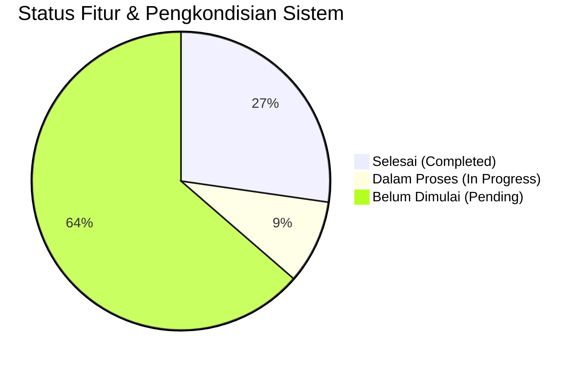

# PROGRESS PENGEMBANGAN SISTEM PRESENSI DIGITAL PKBM PIKAT

**Tanggal Pembaruan:** 14 September 2026  
**Status Proyek:** Fase 1 (Keamanan, Infrastruktur & Fondasi Sistem)  
**Versi Framework:** Laravel 12.52.0 (PHP 8.5.1)  
**Repositori Remote:** `https://github.com/4lliiifffff/pengembangan-presensi-pkbmpikat.git` (Branch: `main`)  

---

## 📊 RINGKASAN PROGRESS KESELURUHAN

| Kategori | Jumlah Item Roadmap | Selesai (🟢) | Dalam Proses (🟡) | Belum Dimulai (⚪) |
|---|---|---|---|---|
| 1. Keamanan & Infrastruktur | 5 | 2 | 1 | 2 |
| 2. Core Presensi & Validasi | 7 | 0 | 1 | 6 |
| 3. Payroll & Honorarium | 4 | 0 | 0 | 4 |
| 4. Integrasi & Notifikasi | 4 | 0 | 0 | 4 |
| 5. Executive Dashboard | 3 | 0 | 0 | 3 |
| 6. Codebase & Testing | 3 | 1 | 1 | 1 |
| **Tambahan (Di Luar Roadmap)** | **5** | **5** | **0** | **0** |

---

## 🚀 1. DETAIL PROGRESS BERDASARKAN ROADMAP PENGEMBANGAN

### 1. Keamanan, Infrastruktur & Performa (System Hardening)
- 🟢 **1.1 (Partial) Perbaikan Deprecation Warning PHP 8.5**
  - **Status:** **SELESAI**
  - **Rincian Implementasi:** Memperbarui `config/database.php` pada opsi koneksi `mysql` dan `mariadb` menggunakan pengecekan dinamis `(defined('Pdo\Mysql::ATTR_SSL_CA') ? Pdo\Mysql::ATTR_SSL_CA : PDO::MYSQL_ATTR_SSL_CA)` untuk menggantikan konstanta `PDO::MYSQL_ATTR_SSL_CA` yang *deprecated* di PHP 8.5.
- 🟢 **1.2 (Partial) Pembersihan Log & Pengamanan File Server**
  - **Status:** **SELESAI**
  - **Rincian Implementasi:** Membuang file `error_log` liar bawaan server Apache/CPanel dari seluruh sub-direktori proyek dan memperbarui `.gitignore` agar tidak melacak file log/temporary.
- ⚪ **1.1 Rate Limiting Login**
  - **Status:** *Pending* (Rencana penerapan Laravel `RateLimiter` pada rute autentikasi).
- ⚪ **1.1 Secure Storage Foto Presensi (Private Storage & Signed URLs)**
  - **Status:** *Pending* (Rencana pemindahan lokasi foto dari `public/uploads/` ke `storage/app/private/`).
- ⚪ **1.2 Script Deployment Otomatis (CI/CD Pipeline)**
  - **Status:** *Pending* (Rencana setup GitHub Actions workflow).

---

### 2. Pengembangan Fitur Inti Presensi (Attendance Core Enhancement)
- 🟡 **2.3 Workflow Digital Lupa Lapor (Approval Kepala Sekolah)**
  - **Status:** **DALAM PROSES (Struktur awal disalin dari baseline)**
  - **Rincian Implementasi:** Model `Lapor_Lapor`, controller `Tutor\LupaLaporController`, dan tabel migrasi sudah tersedia. Selanjutnya akan disempurnakan untuk auto-upsert rekapitulasi kehadiran dan notifikasi Kepala Sekolah.
- ⚪ **2.1 Geofencing & Validasi Lokasi (Haversine & Anti Fake GPS)**
  - **Status:** *Pending*.
- ⚪ **2.2 Verifikasi Wajah Otomatis (Face AI / Gemini Vision)**
  - **Status:** *Pending*.
- ⚪ **2.4 PWA (Progressive Web App) & Offline Mode**
  - **Status:** *Pending*.
- ⚪ **2.5 Pengajuan Izin & Sakit Mandiri oleh Tutor**
  - **Status:** *Pending*.

---

### 3. Integrasi Manajemen Penggajian & Honorarium (Payroll System)
- ⚪ **3.1 Otomatisasi Perhitungan Honor Mengajar Tutor**
  - **Status:** *Pending*.
- ⚪ **3.2 Slip Gaji Digital & Generasi Laporan Keuangan (PDF)**
  - **Status:** *Pending*.

---

### 4. Integrasi Interoperabilitas Sistem & Notifikasi
- ⚪ **4.1 Single Sign-On (SSO via Sanctum/OAuth2) & SIM PKBM Pikat**
  - **Status:** *Pending* (Tabel `personal_access_tokens` dan `laravel/sanctum` sudah terinstal).
- ⚪ **4.2 Integrasi WhatsApp Gateway (Notifikasi Real-time)**
  - **Status:** *Pending*.
- ⚪ **4.3 Import & Export Massal Data (Excel/CSV via Maatwebsite)**
  - **Status:** *Pending* (Paket `maatwebsite/excel` sudah terinstal & terdaftar).

---

### 5. Executive Dashboard & Business Intelligence
- ⚪ **5.1 Dashboard Analytics Kepala Sekolah (Heatmap & KPI)**
  - **Status:** *Pending*.
- ⚪ **5.2 Laporan Standar Akreditasi BAN PAUD & PNF**
  - **Status:** *Pending*.

---

### 6. Refactored Codebase & Quality Assurance
- 🟢 **6.1 Formatting Standard Codebase (Laravel Pint)**
  - **Status:** **SELESAI**
  - **Rincian Implementasi:** Menjalankan `vendor/bin/pint` pada seluruh file controller, model, seeder, dan migration untuk memastikan kesesuaian gaya penulisan kode (*PSR-12 / Laravel Code Style*).
- 🟡 **6.1 Refactoring Pattern DRY (Service & Repository Classes)**
  - **Status:** **DALAM PROSES**
- ⚪ **6.2 Automated Testing Suite (PHPUnit / Pest)**
  - **Status:** *Pending*.

---

## 🛠️ 2. PERUBAHAN & PENGKONDISIAN TEKNIS (DI LUAR ROADMAP UTAMA)

Berikut adalah daftar pekerjaan dan penyesuaian infrastruktur teknis yang telah dikerjakan di luar daftar roadmap awal:

| No | Nama Perubahan / Fitur | Kategori | Deskripsi & Dampak | Status |
|---|---|---|---|---|
| 1 | **Inisialisasi Remote Repositori Git** | Git & VCS | Membuat repositori Git baru, mengatur branch utama ke `main`, menambahkan remote `origin` (`https://github.com/4lliiifffff/pengembangan-presensi-pkbmpikat.git`), dan melakukan commit/push awal. | 🟢 Selesai |
| 2 | **Migrasi Baseline Codebase `presensi-pkbmpikat`** | Core Setup | Memindahkan seluruh kode proyek lama (Controller, Models, Views, Migrations, Seeders, Assets, Config) ke dalam repositori pengembangan baru `pengembangan-presensi-pikat`. | 🟢 Selesai |
| 3 | **Penyesuaian Kompatibilitas Dependensi PHP 8.5** | Environment | Mengonfigurasi `composer.json` dan menjalankan `composer install --ignore-platform-req=php` agar paket-paket seperti `phpoffice/phpspreadsheet`, `maatwebsite/excel`, dan `barryvdh/laravel-dompdf` berjalan lancar di PHP 8.5. | 🟢 Selesai |
| 4 | **Pengaturan Variabel Environment Server Worker** | Performance / Fix | Mengubah `PHP_CLI_SERVER_WORKERS=4` menjadi `PHP_CLI_SERVER_WORKERS=1` pada file `.env` untuk menghilangkan peringatan (*warning*) reloader saat perintah `php artisan serve` dijalankan. | 🟢 Selesai |
| 5 | **Pemasangan & Konfigurasi Laravel Boost MCP** | AI & Tooling | Menginstal dependensi dev `laravel/boost` dan mengonfigurasi file `AGENTS.md` serta aturan pendukung untuk integrasi AI coding assistant yang optimal. | 🟢 Selesai |

---

## 📌 3. REKAPITULASI DOKUMEN & ACTION PLAN SELANJUTNYA

### Item yang Siap Dikerjakan Berikutnya (Next Immediate Tasks):
1. **[Fase 1] Penambahan Rate Limiting Login**: Menambahkan middleware `throttle:login` di rute `routes/web.php` & `routes/api.php`.
2. **[Fase 1 & 2] Secure Storage Foto Presensi**: Membuat private disk dan endpoint pengaksesan foto berbasis *Signed URL*.
3. **[Fase 2] Penyempurnaan Workflow Lupa Lapor**: Menghubungkan persetujuan Lupa Lapor oleh Kepala Sekolah langsung ke pembaruan (*upsert*) tabel `presensis`.
