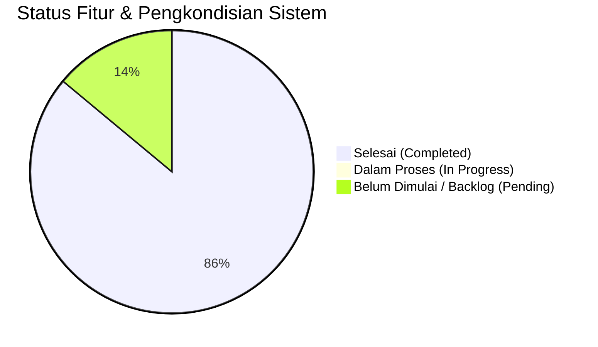

# PROGRESS PENGEMBANGAN SISTEM PRESENSI DIGITAL PKBM PIKAT

**Tanggal Pembaruan:** 16 September 2026  
**Versi Framework:** Laravel 13.31.0 (PHP 8.5.1)  
**Status Proyek:** Fase 1, 2, 3, 4 & 5 (Keamanan, Multi-Moda, Geofencing, Payroll SK Dinamis, Web Push Real-Time, Standardisasi UI/UX, Unified Modal/Dialog, & Validasi Pedagogis Rombel)  
**Repositori Remote:** `https://github.com/4lliiifffff/pengembangan-presensi-pkbmpikat.git` (Branch: `main`)  

---

## 📊 RINGKASAN PROGRESS KESELURUHAN

| Kategori | Jumlah Item Roadmap | Selesai (🟢) | Dalam Proses (🟡) | Belum Dimulai (⚪) |
|---|---|---|---|---|
| 1. Keamanan, Infrastruktur & Performa | 7 | 6 | 0 | 1 |
| 2. Core Presensi & Validasi Lokasi | 8 | 7 | 0 | 1 |
| 3. Payroll & Master Honorarium SK | 7 | 7 | 0 | 0 |
| 4. Integrasi & Web Push Notifikasi | 5 | 3 | 0 | 2 |
| 5. Executive Dashboard & Analytics | 3 | 2 | 0 | 1 |
| 6. UI/UX Excellence & Responsive Layout | 5 | 5 | 0 | 0 |
| 7. Codebase, Standardisasi & QA | 5 | 5 | 0 | 0 |
| **Tambahan (Infrastruktur Teknis & VCS)** | **3** | **3** | **0** | **0** |
| **TOTAL** | **43** | **37** | **0** | **6** |

---

## 🚀 1. DETAIL PROGRESS BERDASARKAN ROADMAP PENGEMBANGAN

### 1. Keamanan, Infrastruktur & Performa (System Hardening)

#### 1.1 Keamanan Autentikasi & Akses Berkas
- 🟢 **Upgrade Framework Laravel 13 (v13.31.0)**
  - **Status:** **SELESAI**
  - **Rincian Implementasi:** Memperbarui `composer.json` ke `"laravel/framework": "^13.0"` dan `"laravel/tinker": "^3.0"`, menyelaraskan dependensi `nunomaduro/collision`, serta meregenerasi autoloader sehingga aplikasi berjalan stabil di atas versi Laravel 13 terbaru (v13.31.0).
- 🟢 **Perbaikan Deprecation Warning PHP 8.5**
  - **Status:** **SELESAI**
  - **Rincian Implementasi:** Memperbarui `config/database.php` pada opsi koneksi `mysql` dan `mariadb` menggunakan pengecekan dinamis `(defined('Pdo\Mysql::ATTR_SSL_CA') ? Pdo\Mysql::ATTR_SSL_CA : PDO::MYSQL_ATTR_SSL_CA)` untuk menggantikan konstanta `PDO::MYSQL_ATTR_SSL_CA` yang *deprecated* di PHP 8.5+.
- 🟢 **Mekanisme Rate Limiting Login**
  - **Status:** **SELESAI**
  - **Rincian Implementasi:** Menambahkan pembatasan percobaan login (maksimal 5 kali per menit per IP/akun) menggunakan Laravel `RateLimiter` dan middleware `throttle:login` di `routes/web.php` & `routes/api.php` untuk mencegah serangan *Brute Force*, dilengkapi respon ramah (pesan peringatan web & HTTP 429 JSON API) serta pembersihan counter saat login berhasil.
- 🟢 **Konfigurasi Reverse Proxy & HTTPS Enforcement**
  - **Status:** **SELESAI**
  - **Rincian Implementasi:** Menambahkan `$middleware->trustProxies(at: '*')` di `bootstrap/app.php` dan `URL::forceScheme('https')` pada `AppServiceProvider` saat request memiliki header SSL/Proxy (`x-forwarded-proto === 'https'`) untuk mencegah terjadinya *Mixed Content Block* pada PWA dan Web Push Notification di reverse proxy/tunnel.
- ⚪ **Secure Storage Foto Presensi (Private Storage & Signed URLs)**
  - **Status:** **PENDING**
  - **Rincian Implementasi:** Pemindahan direktori foto presensi sensitif ke `storage/app/private/` dengan pengaksesan via *Temporary Signed URL* yang mewajibkan autentikasi pengguna dan pembatasan waktu akses.

#### 1.2 Manajemen Log & Infrastruktur Server
- 🟢 **Pembersihan & Pengamanan File Error Log**
  - **Status:** **SELESAI**
  - **Rincian Implementasi:** Membuang file `error_log` liar bawaan server cPanel/Apache, mengalokasikan direktori log ke `storage/logs/`, dan menambahkan pola `error_log` pada `.gitignore` agar tidak mengekspos credential dan log di repositori Git.
- 🟢 **Environment Worker & Config Tuning**
  - **Status:** **SELESAI**
  - **Rincian Implementasi:** Mengatur `PHP_CLI_SERVER_WORKERS=1` dan `APP_URL=http://localhost` pada file `.env` untuk konsistensi server reloader dan pengujian rute HTTP.
- ⚪ **Penerapan Script Deployment Otomatis (CI/CD Pipeline)**
  - **Status:** **PENDING**
  - **Rincian Implementasi:** Pembuatan script *post-deploy* (misal via GitHub Actions) yang otomatis menjalankan `composer install --no-dev`, `php artisan config:cache`, `php artisan route:cache`, dan `php artisan migrate --force`.

---

### 2. Pengembangan Fitur Inti Presensi (Attendance Core Enhancement)

#### 2.1 Storage Abstraction & Management Foto Presensi
- 🟢 **Abstraksi Storage Disk Public & Model Accessor**
  - **Status:** **SELESAI**
  - **Rincian Implementasi:** 
    - Mengabstraksi seluruh controller upload foto (`ProfileController`, `KaryawanController`, `PresensiFotoController`, `KaryawanPresensiController`) menggunakan Laravel `Storage::disk('public')->putFileAs()`.
    - Memindahkan seluruh foto legacy dari `public/uploads/` ke `storage/app/public/uploads/` dan menghapus direktori `public/uploads/` sepenuhnya dari web root.
    - Menambahkan Eloquent Accessors (`$user->foto_url`, `$presensi->foto_mulai_url`, `$presensi->foto_selesai_url`) pada model `User`, `Presensi`, dan `PresensiKaryawan` untuk menjamin 100% *backward compatibility*.

#### 2.2 Workflow Digital Lupa Lapor (Retroactive Attendance Approval)
- 🟢 **Persetujuan Interaktif Kepala Sekolah**
  - **Status:** **SELESAI**
  - **Rincian Implementasi:** 
    - Restrukturisasi dan standardisasi nama model menjadi **`PengajuanLupaLapor`** dengan tabel **`pengajuan_lupa_lapor`** (menggantikan nama legacy `Lapor_Lapor` / `lapor__lapors`).
    - Menambahkan status persetujuan (`pending`, `disetujui`, `ditolak`) dan kolom `catatan_kepsek`.
    - Menyempurnakan alur pengajuan oleh Tutor serta persetujuan interaktif oleh Kepala Sekolah.
    - **Otomatisasi Rekap Presensi**: Ketika Kepala Sekolah mengklik "Setujui", sistem secara otomatis melakukan *upsert* (membuat/memperbarui) data kehadiran pada tabel `presensis` (`status = 'hadir'`).

#### 2.3 Validasi Lokasi & Fitur Lanjutan
- 🟢 **Presensi Multi-Moda (Sekolah, Kunjungan Rumah, Online)**
  - **Status:** **SELESAI**
  - **Rincian Implementasi:** 
    - Menambahkan kolom `moda_pembelajaran` (`sekolah`, `kunjungan_rumah`, `online`) dan `link_daring` pada tabel `presensis`.
    - Mengintegrasikan pemilih moda pembelajaran pada form presensi tutor (`tutor/presensi_foto.blade.php`).
    - **Tatap Muka Sekolah**: Strict Geofencing dari titik sekolah PKBM Pikat.
    - **Kunjungan Rumah (Home Visit)**: Catat titik lokasi GPS kunjungan + foto di rumah murid.
    - **Pembelajaran Online**: Bebas batas radius lokasi + wajib melampirkan foto layar/link ruang pertemuan (Zoom/GMeet).
    - Menambahkan Eloquent Accessor `$presensi->moda_label` untuk kemudahan pelaporan.
- 🟢 **Kalkulasi Radius Lokasi Sekolah (Rumus Haversine), Live Tracking & Interactive Peta Leaflet**
  - **Status:** **SELESAI**
  - **Rincian Implementasi:**
    - Membuat service class `App\Services\GeofencingService` dengan fungsi `calculateDistance()` menggunakan **Rumus Haversine** untuk menghitung jarak antara dua pasang koordinat GPS (latitude/longitude) dalam satuan meter, serta method helper `getGoogleMapsDirectionsUrl()` dan `reverseGeocode()`.
    - Menambahkan titik koordinat sekolah PKBM Pikat (`sekolah_lat`, `sekolah_lng`) dan toleransi radius (`radius_meter` = 100m) pada file konfigurasi `config/lokasi.php` dan file environment `.env`.
    - Mengintegrasikan pemeriksaan batas jarak pada `PresensiFotoController::store()` untuk moda pembelajaran `sekolah`. Jika jarak GPS tutor dengan titik sekolah PKBM Pikat $> 100$ meter, presensi otomatis ditolak dengan pesan peringatan interaktif yang menampilkan jarak sebenarnya.
    - **Live GPS Tracking & Line Track Polyline (`navigator.geolocation.watchPosition` & `L.polyline`)**: Memantau pergerakan pengguna secara realtime saat berjalan/berkendara mendekati sekolah dan menampilkan garis panduan beranimasi putus-putus ke gerbang PKBM Pikat saat berada di luar radius.
    - **Proximity Radar & Auto-Unlock**: Widget jarak interaktif (`.proximityRadarCard`) yang menampilkan sisa meter menuju zona absensi, tombol cepat *"Petunjuk Arah (Google Maps)"*, dan auto-unlock status hijau serta getaran haptic begitu masuk radius 100m.
    - **Interactive Leaflet Map Modal di Rekap Presensi**: Menggantikan iframe statis pada tabel laporan Admin (`admin/laporan/index.blade.php`) dengan peta Leaflet interaktif yang memvisualisasikan titik presensi, titik sekolah, radius geofence, dan garis ukur selisih jarak.
    - Pengujian otomatis komprehensif pada `tests/Feature/GeofencingTest.php` (uji presensi di dalam radius, di luar radius, pengecualian moda online, kalkulasi matematis Haversine, Google Maps directions URL, dan reverse geocoding).
- 🟢 **Fitur Kontrol Kamera Lanjutan (Mirror, Switch Camera, Grid 3x3, Flash/Torch)**
  - **Status:** **SELESAI**
  - **Rincian Implementasi:**
    - **Mirror Mode (`🪞 Mirror`)**: Pratinjau real-time flip horizontal pada video preview dan penangkapan gambar yang di-flip secara konsisten pada 2D canvas HTML5.
    - **Switch Camera (`🔄 Switch`)**: Beralih secara instan antara Kamera Depan (Selfie) dan Kamera Belakang (Kelas/Siswa).
    - **Grid Komposisi (`📐 Grid 3x3`)**: Overlay garis bantu 3x3 *Rule of Thirds* untuk kerapihan foto presensi.
    - **Deteksi Flash/Torch (`⚡ Flash`)**: Integrasi pengontrol senter perangkat jika didukung oleh browser/kamera.
- 🟢 **Seeder Data Komprehensif untuk Pengujian Sistem Seluruh Role**
  - **Status:** **SELESAI**
  - **Rincian Implementasi:**
    - Memperbarui dan menyusun suite seeder lengkap (`DatabaseSeeder.php`):
      1. `AdminSeeder` & `UserRoleSeeder`: 2 Akun Admin (`admin@pkbmpikat.com`, `admin2@pkbmpikat.com`), 1 Akun Kepala Sekolah (`kepsek@pkbmpikat.com`), 3 Akun Tutor (`tutor@pkbmpikat.com` - Budi Santoso, `tutor2@pkbmpikat.com` - Siti Aminah, `tutor3@pkbmpikat.com` - Agus Prasetyo).
      2. `MagangSeeder`: 2 Akun Mahasiswa Magang/PKL (`magang@pkbmpikat.com` - UNESA & `magang2@pkbmpikat.com` - UNAIR).
      3. `KategoriTutorialSeeder`: 6 Master Skema Honor SK Kepala PKBM Pikat.
      4. `SiswaSeeder`: 14 Master Kelas Terstruktur (Paket A 1-6, Paket B 7-9, Paket C 10-12, Vokasi Desain & Tata Busana) dan 12 data siswa realistis (kombinasi Reguler & ABK tersebar ke tutor berbeda).
      5. `JadwalSeeder`: 5 data agenda/kegiatan akademik PKBM Pikat.
      6. `DummyPresensiSeeder`: Data riwayat presensi mengajar multi-moda (Sekolah, Home Visit, Online DL, Gabungan Komunitas) dengan snapshot honor, pengajuan izin/sakit (pending, disetujui, ditolak), permohonan lupa lapor, dan presensi harian magang.
    - Menggunakan metode `updateOrCreate` untuk keamanan re-seeding tanpa duplikasi data (`php artisan db:seed`).
- 🟢 **Deteksi Manipulasi GPS (Anti Fake GPS) & Validasi Akurasi Sinyal**
  - **Status:** **SELESAI**
  - **Rincian Implementasi:**
    - Menambahkan kolom `lokasi_akurasi` (satuan meter) dan `is_mocked` (boolean) pada tabel `presensis`.
    - **Validasi Sinyal & Provider Palsu**: Implementasi method `validateGpsIntegrity()` pada `GeofencingService` untuk menolak presensi jika lokasi berasal dari aplikasi mock location / Fake GPS.
    - **Batas Toleransi Akurasi (`max_accuracy_meter` = 200m)**: Membatasi akurasi sinyal lokasi GPS maksimal 200 meter. Jika akurasi buruk ($> 200$m) atau $0$m, presensi otomatis ditolak.
- 🟢 **PWA (Progressive Web App) & Offline Mode**
  - **Status:** **SELESAI**
  - **Rincian Implementasi:** 
    - **Web App Manifest (`public/manifest.json`)**: Konfigurasi PWA mandiri (`standalone`, theme color `#0B5ED7`, ikon 192x192 & 512x512).
    - **Service Worker (`public/sw.js`)**: Caching aset statis & offline fallback dengan strategi Network-First Cache-Fallback (PWA cache v2).
    - **Penyimpanan Lokal IndexedDB (`resources/js/offline-presensi.js`)**: Database `PikatPresensiOfflineDB` dan antrean offline sync otomatis saat online.
- 🟢 **Pengajuan Izin & Sakit Mandiri oleh Tutor**
  - **Status:** **SELESAI**
  - **Rincian Implementasi:**
    - Tabel `pengajuan_izin_sakit` dan model `PengajuanIzinSakit`.
    - Formulir mandiri Tutor dengan uploader bukti (PDF/JPG/PNG max 2MB) dan alur approval Kepala Sekolah yang otomatis menyinkronkan status `'izin'`/`'sakit'` pada tabel `presensis`.
- 🟢 **Modul Presensi Khusus Role Karyawan Magang (Mahasiswa Magang / Siswa PKL)**
  - **Status:** **SELESAI**
  - **Rincian Implementasi:**
    - Tabel `magangs` dan dukungan role `'magang'`.
    - Alur presensi khusus Clock-In & Clock-Out berbasis foto selfie dan verifikasi geofence radius 100m PKBM Pikat.
    - Dashboard khusus magang, monitoring admin, dan ekspor Laporan Rekap Presensi Magang ke PDF.
- ⚪ **Verifikasi Wajah Otomatis (Face Matching / AI Recognition)**
  - **Status:** **PENDING**
  - **Rincian Implementasi:** Mengintegrasikan pemrosesan AI untuk membandingkan foto presensi tutor secara real-time dengan foto profil master.

---

### 3. Integrasi Manajemen Penggajian & Honorarium Berbasis SK (Payroll System)

#### 3.1 Master Kategori Tutorial & Tarif SK Kepala PKBM
- 🟢 **Master Kategori & Skema Tarif SK Kepala PKBM**
  - **Status:** **SELESAI**
  - **Rincian Implementasi:**
    - Membuat tabel `kategori_tutorials` lengkap dengan model `KategoriTutorial` dan seeder `KategoriTutorialSeeder` untuk 6 kategori master SK:
      1. Tutorial Komunitas (Durasi 2 Jam) = **Rp 75.000,-** / pertemuan
      2. Tutorial Komunitas ABK (Durasi 2 Jam) = **Rp 100.000,-** / pertemuan
      3. Tutorial Komunitas (Durasi 3 Jam) = **Rp 100.000,-** / pertemuan
      4. Gabungan Komunitas per Rombel = **Rp 50.000,-** / rombel
      5. Tutorial Distance Learning / DL (Durasi 1,5 Jam) = **Rp 100.000,-** / pertemuan
      6. Tutorial Distance Learning / DL ABK (Durasi 1,5 Jam) = **Rp 130.000,-** / pertemuan
    - Menambahkan kolom `is_abk` pada tabel `siswas` agar status Anak Berkebutuhan Khusus dikunci di data master siswa oleh Admin.
    - Menambahkan kolom `durasi_pilihan`, `kategori_tutorial_id`, dan `nominal_honor_snapshot` pada tabel `presensis`.

#### 3.2 Dynamic Resolver & Snapshot Immutability
- 🟢 **Engine Honor Dinamis & Snapshot Finansial (`PayrollService`)**
  - **Status:** **SELESAI**
  - **Rincian Implementasi:**
    - Method `PayrollService::resolveHonorSesi()` secara cerdas mencocokkan moda, durasi sesi pilihan tutor, status ABK siswa, dan status gabungan rombel $\rightarrow$ mengunci nilai `nominal_honor_snapshot` saat absensi dibuat.
    - **Snapshot Immutability**: Perubahan tarif di masa depan pada tabel master tidak akan mengubah nominal honor historis yang sudah tersimpan pada presensi yang lalu.
    - **Backward Compatibility**: Presensi legacy tanpa kategori SK (`kategori_tutorial_id = NULL`) tetap dihitung valid via skema per jam lama (`tarif_per_jam × durasi`).

#### 3.3 Peniadaan Form Input Tarif Manual Redundan
- 🟢 **Eliminasi Form Input Tarif Manual**
  - **Status:** **SELESAI**
  - **Rincian Implementasi:**
    - Menghilangkan beban input tarif manual dari form tambah/edit siswa di Admin (`admin/siswa/create.blade.php` & `edit.blade.php`) dan halaman Kepala Sekolah.
    - Form presensi tutor (`tutor/presensi_foto.blade.php`) secara otomatis menyesuaikan durasi sesuai moda (Komunitas: 2 jam / 3 jam / Gabungan rombel; Daring: Otomatis 1,5 jam Distance Learning).

#### 3.4 Slip Gaji Digital & Rekapitulasi Anggaran
- 🟢 **Ekspor Slip Gaji PDF & Rekapitulasi Anggaran**
  - **Status:** **SELESAI**
  - **Rincian Implementasi:**
    - Tampilan slip gaji web dan PDF (`slip_pdf.blade.php`) menampilkan rincian nama kategori tutorial SK, durasi sesi, badge status ABK, dan nominal honor per pertemuan.
    - Laporan rekapitulasi anggaran bulanan admin beserta tombol broadcast pengumuman payroll via Web Push Notification.

---

### 4. Integrasi Interoperabilitas Sistem & Notifikasi (Integrations)

#### 4.1 Web Push Notification Real-Time (PWA & FCM Push Service)
- 🟢 **Infrastruktur Web Push, VAPID & Guzzle Client**
  - **Status:** **SELESAI**
  - **Rincian Implementasi:** Paket `minishlink/web-push`, command `webpush:vapid`, migrasi `push_subscriptions`, dan `WebPushService` dengan proteksi SSL bypass Windows/Laragon.
- 🟢 **Auto-Sync Token Browser & Client Push Manager**
  - **Status:** **SELESAI**
  - **Rincian Implementasi:** Script `resources/js/push-notification.js` auto-sinkronisasi token browser, auto-reconnect, dan pengujian push mandiri di menu Profil.
- 🟢 **Otomatisasi Trigger Push Notifikasi Sistem**
  - **Status:** **SELESAI**
  - **Rincian Implementasi:** Notifikasi instan presensi masuk/pulang, pengajuan izin/sakit, permohonan lupa lapor, scheduler cron pengingat jadwal mengajar harian (`presensi:send-reminder`), dan broadcast pengumuman slip gaji.

#### 4.2 Import & Export Massal Data (Bulk Data Management)
- 🟢 **Import & Export Spreadsheet Excel/CSV**
  - **Status:** **SELESAI**
  - **Rincian Implementasi:** Ekspor laporan presensi komprehensif 14 kolom + KPI cards (`PresensiExport.php`), ekspor/import massal data Siswa, Tutor/Karyawan, Jadwal/Agenda, dan Presensi Retroaktif via `maatwebsite/excel`.

#### 4.3 Integrasi Eksternal (Jangka Panjang)
- ⚪ **Integrasi Akun Terpusat (SSO SIM PKBM Pikat via Sanctum / OAuth2)**: [PENDING]
- ⚪ **Notifikasi WhatsApp Gateway**: [PENDING]

---

### 5. Executive Dashboard & Business Intelligence (Analytics)

#### 5.1 Dashboard Analytics Kepala Sekolah
- 🟢 **Heatmap Kehadiran, Tren Kinerja & Leaderboard KPI Tutor**
  - **Status:** **SELESAI**
  - **Rincian Implementasi:** Grafik interaktif Chart.js tren kehadiran 6 bulan terakhir (`AnalyticsService.php`), kalkulasi skor composite KPI Tutor, dan leaderboard peringkat kedisiplinan (#1 Gold, #2 Silver, #3 Bronze).

#### 5.2 Laporan Standar Akreditasi Pendidikan
- ⚪ **Format Laporan Otomatis Akreditasi Pendidikan Kesetaraan (BAN PDM / PNF)**: [PENDING]

---

### 6. Standardisasi UI/UX, Layout Responsif & Feedback Terpadu

#### 6.1 Standardisasi Navigasi & Spacing Dashboard Antar Role
- 🟢 **Sticky Top Navigation & Breathing Room Layout**
  - **Status:** **SELESAI**
  - **Rincian Implementasi:**
    - Penyelarasan topbar navigasi sticky yang bersih di semua role (`tutor`, `magang`, `admin`, `kepala_sekolah`).
    - Penambahan header section `.sectionTitleRow` pada dashboard Tutor dan Magang untuk memberikan jarak pemisah visual yang rapi dari navigasi atas (mengeliminasi bug kartu yang menempel 0px ke topbar).
    - Penataan grid 2-kolom seimbang (*equal visual weight*) di desktop ($\ge 992$px) dan 1 kolom nyaman di mobile.

#### 6.2 Unified Modal, Toast, & Dialog System
- 🟢 **Sistem Modal Dialog & Toast Modern**
  - **Status:** **SELESAI**
  - **Rincian Implementasi:**
    - Menggantikan dialog native browser (`alert()`, `confirm()`) dengan modal pop-up dan toast notification terpadu (`app-dialog-overlay`, `app-toast-container`) yang elegan, beranimasi halus, dan mendukung dark/light mode.
    - Memperbaiki isu tombol tidak responsif saat dialog izin kamera/lokasi muncul di halaman presensi.

#### 6.3 Desain Halaman Pengajuan Izin & Sakit Tutor
- 🟢 **Redesain Form & Riwayat Izin Tutor**
  - **Status:** **SELESAI**
  - **Rincian Implementasi:**
    - Struktur layout `.pengajuanPage` yang lega dan responsif, formulir bersih `.izinFormCard`, dan tab switch `.tabBar`.
    - Grid tanggal adaptif (`.dateInputRow`) yang otomatis 1 kolom pada layar HP (< 520px) dan 2 kolom pada tablet/desktop.
    - Kartu riwayat pengajuan izin lengkap dengan status badge, tombol pratinjau surat bukti, dan dialog pembatalan interaktif.

#### 6.4 Validasi Pedagogis & Deteksi Otomatis Sesi Gabungan Komunitas (Multi-Rombel)
- 🟢 **Master Data Kelas Terstruktur per Paket & Deteksi Otomatis Multi-Rombel**
  - **Status:** **SELESAI**
  - **Rincian Implementasi:**
    - **Struktur Master Kelas Lengkap & Kolom Terstruktur (`jenjang_paket` & `tingkat`)**:
      - Menambahkan migrasi `2026_09_16_000005_add_jenjang_paket_and_tingkat_to_kelas_table.php` yang menambahkan kolom `jenjang_paket` (varchar 50, indexed) dan `tingkat` (varchar 50) pada tabel `kelas`.
      - Mendukung kategorisasi modular fleksibel untuk jenjang masa depan seperti `'Vokasi'`, `'Kursus'`, `'Kejuruan'`, dsb.
      - Menyiapkan data kelas terstruktur pada database seeder (`SiswaSeeder.php`): Paket A (Kelas 1–6), Paket B (Kelas 7–9), dan Paket C (Kelas 10–12).
    - **Deteksi Otomatis Sesi Gabungan (Multi-Rombel)**:
      - Backend (`PresensiFotoController.php`) otomatis mendeteksi jika murid yang dipilih berasal dari $>1$ kelas berbeda dalam jenjang paket yang sama $\rightarrow$ otomatis menetapkan status gabungan rombel (`$isGabungan = true`) dan menghitung honor **Gabungan Komunitas (Rp 50.000,- / rombel)**.
      - Jika murid berasal dari 1 kelas yang sama $\rightarrow$ otomatis menetapkan sebagai **Tutorial Komunitas Standar** (Rp 75.000,- / Rp 100.000,- ABK).
      - Jika murid berasal dari paket berbeda $\rightarrow$ ditolak otomatis oleh sistem (*Universal Package Guard*).
    - **Realtime Frontend Visual Guide**: Di form presensi tutor (`presensi_foto.blade.php`), sistem menampilkan badge interaktif `#rombelDetectionBadge` (*"⚡ Terdeteksi Sesi Gabungan: 2 Rombel"* vs *"✓ Sesi 1 Rombel Reguler"*), auto-check checkbox gabungan dengan badge `[⚡ Otomatis]`, dan alert mismatch paket.
    - Automated feature testing: `tests/Feature/PresensiMultiModaTest.php` (`test_auto_detect_gabungan_komunitas_when_students_from_different_classes_in_same_package` & `test_auto_detect_single_rombel_when_students_from_same_class`).

#### 6.5 Total Refactoring Eliminasi Kolom Legacy `tarif_per_jam`
- 🟢 **Pembersihan Total Kolom Redundan `tarif_per_jam`**
  - **Status:** **SELESAI**
  - **Rincian Implementasi:**
    - Menambahkan migrasi `2026_09_16_000004_drop_tarif_per_jam_from_siswas_table.php` untuk menghapus kolom `tarif_per_jam` dari tabel `siswas`.
    - Menghapus atribut `$fillable` dan casts `tarif_per_jam` dari model `Siswa.php`.
    - Membersihkan kode fallback lama di `PayrollService.php` sehingga kalkulasi payroll 100% tersentralisasi pada tabel master `kategori_tutorials` (dan fallback SK default PKBM Pikat).
    - Memperbarui form Admin `SiswaController.php`, view `create.blade.php`, `edit.blade.php`, serta seluruh class export/import Excel (`SiswaExport`, `SiswaImport`, `PayrollBulkTarifTemplateExport`, `PayrollBulkTarifImport`).

#### 6.6 Antarmuka & Modul Manajemen Data Kelas & Rombel (Admin)
- 🟢 **Penyempurnaan CRUD Kelas, Filter Jenjang & Visual Rombel**
  - **Status:** **SELESAI**
  - **Rincian Implementasi:**
    - **Controller (`KelasController.php`)**: Validasi dan penyimpanan kolom terstruktur `jenjang_paket`, `tingkat`, dan `keterangan`. Mendukung pencarian teks cepat (`q`) dan filter tab per jenjang paket secara dinamis.
    - **Tampilan Form (`create.blade.php` & `edit.blade.php`)**: Form modern yang membaca opsi jenjang paket secara dinamis dari tabel `jenjang_pakets`, tombol format otomatis (`[⚡ Format Otomatis]`), dan quick link ke Master Jenjang.
    - **Tampilan Daftar Kelas (`index.blade.php`)**: Filter quick tabs dinamis, badge warna jenjang paket, indikator tingkat, jumlah siswa terdaftar, dan proteksi penghapusan kelas aktif.
    - **Pengelompokan Dropdown Siswa (`SiswaController.php`, `admin/siswa/create.blade.php` & `edit.blade.php`)**: Dropdown pemilihan kelas dikelompokkan rapi per jenjang paket menggunakan `<optgroup>`.
    - **Automated Feature Test**: `tests/Feature/AdminKelasManagementTest.php`.

#### 6.7 Modul Master Jenjang & Program Paket Dinamis (`jenjang_pakets`)
- 🟢 **Master Data Jenjang / Program Kesetaraan & Vokasi 100% Dinamis**
  - **Status:** **SELESAI**
  - **Rincian Implementasi:**
    - **Database Migration (`2026_09_16_000006_create_jenjang_pakets_table.php`)**: Tabel `jenjang_pakets` dengan kolom `kode`, `nama_jenjang`, `tingkat_label`, `keterangan`, `urutan`, dan `is_aktif`.
    - **Model (`App\Models\JenjangPaket.php`)**: Relasi `hasMany(kelas::class, 'jenjang_paket', 'kode')`, scope `scopeAktif()`, dan scope `scopeOrdered()`. Relasi timbal balik di `kelas::masterJenjang()` dengan fallback dinamis.
    - **Admin Controller & CRUD UI (`JenjangPaketController.php` & `admin/jenjang_paket/index.blade.php`)**: Antarmuka master lengkap dengan tabel responsif, modal create/edit dengan slug/kode generator otomatis, toggle status aktif/nonaktif, dan proteksi penghapusan bila ada kelas/rombel yang terikat.
    - **Seeder Awal (`JenjangPaketSeeder.php`)**: 6 Master Jenjang baku (Paket A, Paket B, Paket C, Vokasi, Kursus, Umum).
    - **Automated Feature Tests (`tests/Feature/AdminJenjangPaketTest.php`)**: 6 skenario pengujian komprehensif (Index, Store, Update, Toggle Status, Delete Protection, dan Dynamic Loader di Form Kelas).

---

### 7. Refactored Codebase, Standardisasi & QA

#### 7.1 Standardisasi System Codebase
- 🟢 **Laravel Pint Code Formatter**: `vendor/bin/pint --format agent` lolos 100% di seluruh file controller, model, view, seeder, dan migration.
- 🟢 **Sentralisasi Design System via `resources/css/app.css`**: Menyatukan seluruh styling CSS komponen, menghapus inline styles, dan merapikan layout Vite native.
- 🟢 **Standardisasi Folder Views (`resources/views/layouts/`)**: Konsolidasi layout, navigasi berbahasa Indonesia, dan pembersihan file *dead-code*.

#### 7.2 Automated Testing Suite
- 🟢 **PHPUnit Test Suite**: Seluruh **79 Feature & Unit Tests** lulus 100% (**330 assertions**).
- 🟢 **Vite Production Assets**: `npm run build` berjalan bersih tanpa error.

---

## 🛠️ 2. PERUBAHAN & PENGKONDISIAN TEKNIS (INFRASTRUKTUR & VCS)

| No | Nama Perubahan / Fitur | Kategori | Deskripsi & Dampak | Status |
|---|---|---|---|---|
| 1 | **Inisialisasi Remote Repositori Git** | Git & VCS | Repositori Git baru, branch `main`, remote `origin` (`https://github.com/4lliiifffff/pengembangan-presensi-pkbmpikat.git`), commit/push. | 🟢 Selesai |
| 2 | **Migrasi Baseline Codebase `presensi-pkbmpikat`** | Core Setup | Memindahkan seluruh kode proyek lama ke dalam repositori pengembangan baru. | 🟢 Selesai |
| 3 | **Penyesuaian Kompatibilitas Dependensi PHP 8.5** | Environment | Konfigurasi `composer.json` & paket `maatwebsite/excel`, `barryvdh/laravel-dompdf` di PHP 8.5. | 🟢 Selesai |
| 4 | **Pemasangan & Konfigurasi Laravel Boost MCP** | AI & Tooling | Instalasi dev `laravel/boost` dan konfigurasi file `AGENTS.md`. | 🟢 Selesai |
| 5 | **Implementasi Web Push Service & VAPID Tooling** | Push Service | Menambahkan `minishlink/web-push`, command `webpush:vapid`, dan integrasi Service Worker PWA v2. | 🟢 Selesai |
| 6 | **Master Kategori & Skema Tarif SK Kepala PKBM** | Payroll SK | Migrasi `kategori_tutorials`, seeder 6 skema SK, dynamic snapshot resolver, dan eliminasi form manual. | 🟢 Selesai |
| 7 | **UI/UX Excellence & Unified Dialog System** | Frontend | Standardisasi layout dashboard, sticky navigation, unified modern dialog/toast, dan form izin responsif. | 🟢 Selesai |
| 8 | **Master Kelas Terstruktur & Deteksi Otomatis Sesi Gabungan** | Core Presensi | Master kelas Paket A (1-6), B (7-9), C (10-12) & auto-detect multi-rombel vs 1 rombel reguler. | 🟢 Selesai |
| 9 | **Total Refactoring `tarif_per_jam` & Skema Terstruktur `kelas`** | Database Refactor | Drop `siswas.tarif_per_jam`, tambah `kelas.tingkat` (varchar 50) untuk modularitas Vokasi/Paket baru. | 🟢 Selesai |
| 10 | **Refactoring Foreign Key Relasional `kelas.jenjang_paket_id`** | Database Integrity | Migrasi Foreign Key murni `kelas.jenjang_paket_id` $\rightarrow$ `jenjang_pakets.id` dengan ON DELETE SET NULL, menggantikan kolom kode string legacy demi integritas referensial database MySQL. | 🟢 Selesai |
| 11 | **Penguatan Integrasi Murid > Kelas > Paket & Anti Data-Loss** | Academic Lifecycle | Menambahkan status siklus siswa (`aktif`, `alumni`, `cuti`, `nonaktif`), SoftDeletes (`deleted_at`), relasi `hasOneThrough` (`masterJenjang`), dan fitur migrasi pengalihan kelas saat hapus jenjang. | 🟢 Selesai |

---

## 📌 3. REKAPITULASI DOKUMEN & ACTION PLAN SELANJUTNYA

### Item Backlog Terencana (Fase Lanjutan):
- **Master Asesmen & Tugas Penunjang**: Tabel `honor_asesmens` & `honor_penunjangs` (soal STS/SAS, periksa, awas, rapor, rapat, outing).
- **Secure Storage Foto Presensi**: Pemindahan direktori foto sensitif ke `storage/app/private/` dengan *Temporary Signed URL*.
- **Integrasi SSO SIM PKBM Pikat & WhatsApp Gateway**: Single Sign-On akun terpusat dan pengiriman notifikasi via WA ke wali murid.
- **Laporan Standar Akreditasi Pendidikan Kesetaraan (BAN PDM / PNF)**: Template laporan otomatis yang disesuaikan dengan instrumen akreditasi pendidikan nonformal.
