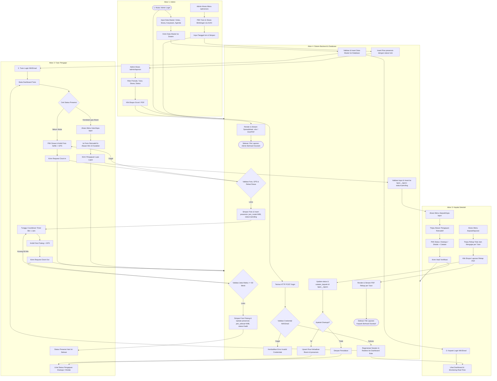

# ALUR LENGKAP PROSES BISNIS SISTEM PRESENSI PKBM PIKAT
## Diagram Swimlane Vertikal Sekuensial (4 Aktor Terintegrasi)

---

## 1. AKTOR SISTEM YANG TERINVOLVASI

Berdasarkan arsitektur dan hak akses di aplikasi Presensi PKBM Pikat, terdapat **4 Aktor Utama**:

1. **Admin (Administrator Sistem):** Memulai alur dengan mengelola data master (Siswa, Kelas, User/Karyawan, Jadwal Agenda), mencatat izin tutor, dan mengekspor laporan presensi.
2. **Tutor (Pengajar):** Menerima hak akses login, melakukan presensi harian berbasis foto & GPS (*Clock-In* & *Clock-Out* min 1 jam), serta mengajukan *Lupa Lapor* jika ada kendala.
3. **Kepala Sekolah (Kepsek):** Memantau statistik kehadiran harian/mingguan, meninjau & memverifikasi pengajuan *Lupa Lapor*, serta mengunduh laporan rekapitulasi PDF per tutor.
4. **Sistem (Laravel Backend & Database):** Mengeksekusi otentikasi dual-field, validasi aturan bisnis (WIB server, durasi 1 jam, relasi data), penyimpanan berkas foto, dan penyusunan file laporan.

*(Catatan: Siswa tidak dimasukkan sebagai aktor swimlane karena siswa tidak memiliki akun login/interaksi langsung dengan sistem web).*

---

## 2. DIAGRAM SWIMLANE VERTIKAL SEKUANSIAL LENGKAP (MERMAID)

Diagram berikut disusun sekuensial dimulai dari **pojok kiri atas (Admin)** dan mengalir secara kontinu (*tanpa ada langkah yang terputus atau tiba-tiba muncul*):

---

## 3. PENJABARAN ALUR OPERASIONAL BERKESINAMBUNGAN (STEP-BY-STEP)

### Langkah 1: Inisialisasi Data Master (Admin -> Backend)
1. **Admin** membuka sistem dan menginput data Kelas, Siswa (penugasan tutor pembimbing), Akun Pengguna (Role Tutor & Kepsek), serta Agenda Kegiatan.
2. **Sistem Backend** memvalidasi dan menyimpan data ke basis data MySQL. Akun Tutor dan Kepsek kini aktif dan siap digunakan.

### Langkah 2: Autentikasi Dual-Field (Pengguna -> Backend)
1. **Tutor** dan **Kepala Sekolah** melakukan login menggunakan NIK atau Email beserta Password.
2. **Sistem Backend** memverifikasi kredensial, melakukan regenerasi Session ID, dan mengarahkan pengguna ke dashboard sesuai perannya (`/tutor/dashboard` atau `/kepsek/dashboard`).

### Langkah 3: Presensi Mengajar Real-Time (Tutor -> Backend)
1. **Tutor** yang berada di lokasi bimbingan membuka `/tutor/dashboard` dan memilih siswa yang diajar.
2. Tutor mengambil foto *selfie* mengajar & lokasi GPS, lalu mengirimkan request **Clock-In**.
3. **Sistem Backend** memvalidasi foto & kepemilikan siswa, menyimpan file ke `public/uploads/presensi/`, dan mencatat `jam_mulai` berbasis waktu server WIB (`Asia/Jakarta`). Status presensi berubah menjadi **Pending (Proses)** dengan timer 1 jam.
4. Sesi mengajar berlangsung $\ge 60$ menit.
5. Setelah durasi terpenuhi, Tutor mengambil foto *Clock-Out*.
6. **Sistem Backend** memverifikasi jeda waktu ($\ge 1$ jam), memperbarui `jam_selesai`, dan memperbarui status presensi menjadi **Hadir (Selesai)**.

### Langkah 4: Pengajuan & Verifikasi Lupa Lapor (Tutor -> Kepsek -> Backend)
1. Jika Tutor terkendala presensi pada hari yang lalu, Tutor mengisi form pengajuan di `/tutor/lupa-lapor` (siswa, tanggal, jam, alasan $\ge 10$ karakter).
2. **Sistem Backend** menyimpan pengajuan ke `lapor__lapors` dengan `status = pending`.
3. **Kepala Sekolah** meninjau pengajuan di `/kepsek/lupa-lapor` dan menentukan status (*Disetujui/Ditolak*) serta memberikan catatan.
4. **Sistem Backend** memperbarui record di `lapor__lapors`. Jika disetujui, sistem secara otomatis memasukkan data kehadiran resmi ke tabel `presensis`.

### Langkah 5: Pencatatan Izin Tutor (Admin -> Backend)
1. Apabila Tutor berhalangan mengajar, **Admin** membuka `/admin/izin`.
2. Admin memilih nama Tutor (sistem memuat daftar siswa bimbingan via AJAX) dan menginput tanggal izin.
3. **Sistem Backend** menyimpan record presensi dengan `status = izin`.

### Langkah 6: Monitoring & Ekspor Laporan (Admin & Kepsek -> Backend -> Selesai)
1. **Admin** menyaring data di `/admin/laporan` dan mengekspor laporan ke **Excel (XLSX)** atau **PDF**.
2. **Kepala Sekolah** meninjau rekapitulasi total jam mengajar di `/kepsek/laporan` dan mengunduh laporan rekap **PDF**.
3. File laporan terunduh dan proses bisnis selesai.
